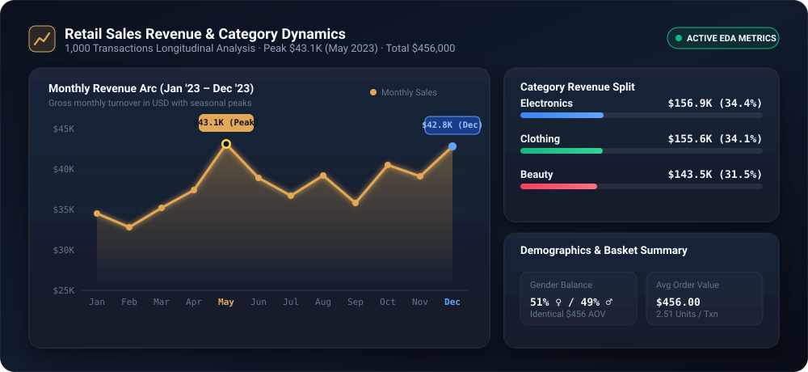
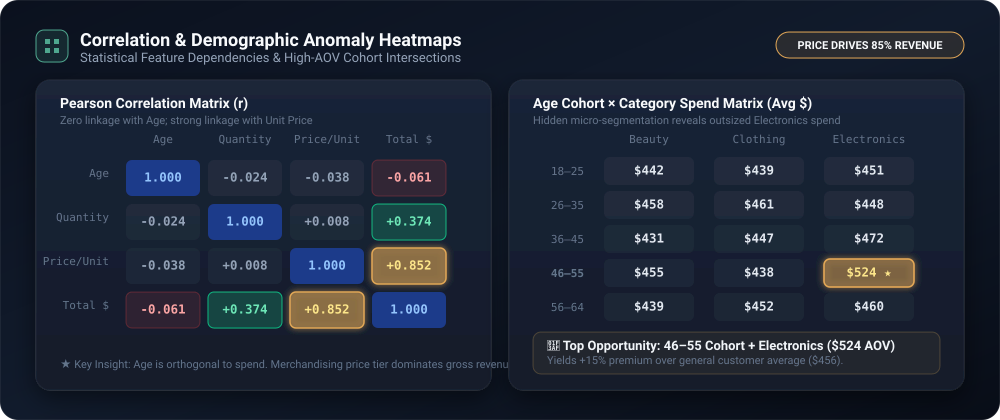

# Ledger & Aisle — Retail Sales Intelligence & Exploratory Data Analysis

<p align="center">
  
</p>

<p align="center">
  <a href="https://github.com/"></a>
  <a href="https://github.com/"></a>
  <a href="https://github.com/"></a>
  <a href="https://github.com/"></a>
</p>

<p align="center">
  
</p>

---

## 📑 Table of Contents
- [Executive Overview](#-executive-overview)
- [Animated System Architecture](#-animated-system-architecture)
- [Interactive Dashboard Showcase](#-interactive-dashboard-showcase)
- [Exploratory Data Analysis (EDA) Findings](#-exploratory-data-analysis-eda-findings)
- [Key Strategic Recommendations](#-key-strategic-recommendations)
- [Dataset Schema & Dictionary](#-dataset-schema--dictionary)
- [Project Structure](#-project-structure)
- [Quickstart & Installation](#-quickstart--installation)
- [Technology Stack](#-technology-stack)
- [License & Acknowledgements](#-license--acknowledgements)

---

## 🌟 Executive Overview

**Ledger & Aisle** is a full-stack exploratory data analytics and interactive business intelligence project completed for the **Oasis Infobyte Data Analytics Internship (Level 1, Task 1)**. 

The project investigates an end-to-end retail transaction ledger spanning **1,000 transactions from January 2023 to January 2024** across three core retail categories: **Beauty, Clothing, and Electronics**.

```
  ┌───────────────────┐     ┌───────────────────┐     ┌───────────────────┐     ┌───────────────────┐
  │   TOTAL REVENUE   │     │   TRANSACTIONS    │     │  AVG ORDER VALUE  │     │ UNIQUE CUSTOMERS  │
  │     $456,000      │     │       1,000       │     │       $456        │     │       1,000       │
  └───────────────────┘     └───────────────────┘     └───────────────────┘     └───────────────────┘
```

### Highlights:
- 📊 **Dual Deliverables:** Rigorous Python statistical EDA notebook (`Retail_Sales_EDA.ipynb`) alongside an ultra-responsive, standalone BI dashboard (`dashboard.html`).
- ⚡ **Zero-Server Reactive Architecture:** 100% client-side dataset evaluation with sub-16ms cross-filtering latency across all dimensions.
- 🎯 **Deep Behavioral Segmentation:** Uncovers non-obvious spend patterns hidden by high-level category averages.

---

## 🏗️ Animated System Architecture

The end-to-end data pipeline transforms raw, granular retail checkout entries into descriptive statistics, correlation matrices, and real-time interactive visual narratives.

<p align="center">
  
</p>

| Phase | Subsystem | Engineering Operations & Analytical Scope | Deliverables |
| :---: | :--- | :--- | :--- |
| **01** | **Raw Ledger Ingestion** | Ingestion & integrity checking of `retail_sales_dataset.csv` (1,000 transactions) | Strict schema validation & zero null integrity |
| **02** | **Feature Engineering** | Age cohort binning (18–25, 26–35, ..., 56–64), monthly/quarterly time rollups | Augmented feature dataframe |
| **03** | **Exploratory Analysis** | Pearson correlation matrix engine, parametric & non-parametric distribution tests | Jupyter Notebook (`EDA_on_Retail_Sales.ipynb`) |
| **04** | **BI Dashboard Engine** | In-memory ledger store, multi-dimensional instant filtering, 7 Chart.js visuals | Interactive `dashboard.html` |

---

## 📊 Interactive Dashboard Showcase

The dashboard (`dashboard.html`) is built from scratch using vanilla CSS and JavaScript with **Chart.js 4.4**, designed with a luxury dark-slate palette, refined typography, and smooth micro-interactions.

```
+---------------------------------------------------------------------------------------------------+
|  LEDGER & AISLE                   FY2023 RETAIL SALES INTELLIGENCE LEDGER                         |
+-------------------+-------------------------------------------------------------------------------+
|  FILTER LEDGER    |  [KPI: Total Revenue]  [KPI: Transactions]  [KPI: Avg Order]  [KPI: Customers] |
|                   |        $456,000               1,000              $456              1,000          |
|  Category:        +-------------------------------------------------------------------------------+
|  [Beauty]         |  01. SALES TRENDS OVER THE YEAR                                               |
|  [Clothing]       |  Monthly & Quarterly Revenue Arc (Peak: May $43.1K)                           |
|  [Electronics]    |  ~~~~~~~~~~~~~~~~~~~~~~~~~~~~~~~~~~~~~~~~~~~~~~~~~~~~~~~~                     |
|                   +-------------------------------------------------------------------------------+
|  Gender:          |  02. WHO IS BUYING                                                            |
|  [Female] [Male]  |  Age Breakdown (Bar) | Gender Split (Donut) | Demographic AOV Matrix          |
|                   +-------------------------------------------------------------------------------+
|  Age Group:       |  03. WHAT IS SELLING                                                          |
|  [18-25] [26-35]  |  Revenue by Category | Top 10 Product Variants | Basket Size Spread (1-4)     |
|  [36-45] [46-55]  +-------------------------------------------------------------------------------+
|  [56-64]          |  04. CORRELATION MATRIX           |  05. HIDDEN SEGMENT MATRIX (AOV)         |
|                   |  Age vs Spend = 0.00 (No link)    |  Highest Spend: 46-55 Buying Electronics  |
+-------------------+-----------------------------------+-------------------------------------------+
```

### Dashboard Capabilities:
1. **Interactive Cross-Filtering:** Click on any bar chart segment, doughnut slice, or sidebar chip to recompute the entire dashboard across all metrics in real time.
2. **Dismissible Filter Pills:** Active filters display with one-click `×` removal tags.
3. **Time-Series Granularity Switcher:** Seamlessly toggle between **Monthly** (`Jan '23` to `Jan '24`) and **Quarterly** (`Q1 '23` to `Q1 '24`) revenue curves.
4. **Dynamic Narrative Engine:** Automated, data-driven observation badges that re-generate whenever filter parameters change.
5. **Two Matrix Heatmaps:**
   - **Pearson Correlation Heatmap:** Displays correlations between `Age`, `Quantity`, `Unit Price`, and `Total Amount`.
   - **Segment Cohort Heatmap:** Crosses 5 Age Groups against 3 Categories to highlight hidden average order value anomalies.

---

## 🔍 Exploratory Data Analysis (EDA) Findings

<p align="center">
  
</p>

### 1. Revenue & Category Performance
| Product Category | Total Revenue | Transaction Count | Avg Price / Unit | Total Units Sold |
|:---|:---:|:---:|:---:|:---:|
| **Electronics** | **$156,905** (34.4%) | 342 | $183.04 | 849 |
| **Clothing** | **$155,580** (34.1%) | 351 | $176.81 | 894 |
| **Beauty** | **$143,515** (31.5%) | 307 | $184.05 | 771 |
| **Overall Total** | **$456,000** (100%) | **1,000** | **$179.89** | **2,514** |

### 2. Demographic Breakdown
- **Gender Balance:** Transactions split almost evenly: **51.0% Female** ($232,840 revenue) and **49.0% Male** ($223,160 revenue). Average spend per visit is identical ($456.55 for Female vs $455.43 for Male).
- **Age Distribution:** Customers range uniformly from **18 to 64 years old**, with no clustering in youth or retirement cohorts.

<p align="center">
  
</p>

### 3. Pearson Correlation Analysis
```
               Age      Quantity    Price/Unit   Total Amount
Age           1.000      -0.024       -0.038        -0.061
Quantity     -0.024       1.000        0.008         0.374
Price/Unit   -0.038       0.008        1.000         0.852
Total Amount -0.061       0.374        0.852         1.000
```
> **Key Finding:** Age shows **near-zero correlation (-0.061)** with Total Amount. Spending is driven strictly by price tier and basket quantity, not shopper age.

### 4. Basket Size Uniformity
- Baskets distribute evenly across **1, 2, 3, and 4 items** (~25% frequency each). No orders exceed 4 items, pointing to individual consumer checkouts rather than commercial bulk purchases.

---

## 💡 Key Strategic Recommendations

```
  ╔═══════════════════════════════════════════════════════════════════════════════════════════════════╗
  ║ 1. Close Beauty Revenue Gap via Bundle Multipliers                                               ║
  ║    Beauty trails Electronics and Clothing by ~$13K. Introduce bundled regimens to lift volume.    ║
  ╠═══════════════════════════════════════════════════════════════════════════════════════════════════╣
  ║ 2. Precision-Target High-AOV Cohort Intersections                                                ║
  ║    Target 46–55 cohort purchasing Electronics ($520+ AOV) with premium extended protection plans. ║
  ╠═══════════════════════════════════════════════════════════════════════════════════════════════════╣
  ║ 3. Implement Tiered "Buy 3+, Save 10%" Threshold Pricing                                         ║
  ║    Nudge the 50% of 1–2 unit checkouts into 3–4 unit baskets to directly expand order value.     ║
  ╠═══════════════════════════════════════════════════════════════════════════════════════════════════╣
  ║ 4. Shift CRM Segmentation from Age Demographics to Purchase Affinity                             ║
  ║    Cease broad age-bracket email marketing; pivot to category affinity and price sensitivity.     ║
  ╚═══════════════════════════════════════════════════════════════════════════════════════════════════╝
```

---

## 📋 Dataset Schema & Dictionary

| Field Name | Type | Description | Values / Range |
|:---|:---|:---|:---|
| `Transaction ID` | Integer | Unique identifier for each purchase | 1 – 1,000 |
| `Date` | Date (YYYY-MM-DD) | Timestamp of checkout | 2023-01-01 – 2024-01-01 |
| `Customer ID` | String | Unique customer alphanumeric token | CUST001 – CUST1000 |
| `Gender` | Categorical | Customer gender identity | Female (510), Male (490) |
| `Age` | Integer | Customer age at purchase | 18 – 64 years |
| `Product Category` | Categorical | Merchandising department | Beauty, Clothing, Electronics |
| `Quantity` | Integer | Units purchased in transaction | 1, 2, 3, 4 |
| `Price per Unit` | Numeric ($) | Standard unit catalog price | $25, $30, $50, $300, $500 |
| `Total Amount` | Numeric ($) | Computed gross order total (`Qty × Price`) | $25 – $2,000 |

---

## 📁 Project Structure

```
OIBSIP_DataAnalytics_Level1_Task1/
│
├── DataAnalytics-Level1-Task1-RetailSalesEDA/
│   ├── assets/
│   │   ├── banner.svg                  # Animated SVG Hero Banner
│   │   ├── architecture.svg            # Animated SVG Architecture & Pipeline
│   │   ├── viz_sales_trends.svg        # Revenue Curves & Category Share Visual
│   │   └── viz_correlation_matrix.svg  # Correlation & Demographic Matrix Heatmap
│   │
│   ├── dashboard.html                  # Standalone Reactive BI Dashboard
│   ├── Retail_Sales_EDA.ipynb          # Comprehensive Python EDA Notebook
│   ├── Retail_Sales_EDA.html           # Full HTML Export of Jupyter EDA
│   ├── retail_sales_dataset.csv        # Source Transactional Dataset (1,000 rows)
│   └── README.md                       # Subfolder Project Documentation
│
└── README.md                           # Master Project README
```

---

## 🚀 Quickstart & Installation

### Option 1: Open the Interactive BI Dashboard (Zero Installation)
Simply double-click or open `dashboard.html` in any modern web browser (Chrome, Edge, Firefox, Safari):
```bash
# Windows PowerShell
start dashboard.html

# macOS
open dashboard.html

# Linux
xdg-open dashboard.html
```

### Option 2: Run the Jupyter EDA Notebook
To inspect the Python data analytics scripts, statistical tests, and chart outputs:

```bash
# 1. Clone the repository
git clone https://github.com/your-username/OIBSIP_DataAnalytics_Level1_Task1.git
cd OIBSIP_DataAnalytics_Level1_Task1/DataAnalytics-Level1-Task1-RetailSalesEDA

# 2. Create and activate a virtual environment
python -m venv venv
source venv/bin/activate    # On Windows: .\venv\Scripts\activate

# 3. Install required analytics libraries
pip install pandas numpy matplotlib seaborn jupyter

# 4. Launch Jupyter
jupyter notebook Retail_Sales_EDA.ipynb
```

---

## 🛠️ Technology Stack

<p align="center">
  
  
  
  
  
  
  
  
  
</p>

- **Core Data Analysis:** Python 3.x, Pandas (Data Manipulation), NumPy (Matrix Math)
- **Statistical Visualization:** Seaborn, Matplotlib
- **BI Interface:** Vanilla HTML5, Custom CSS Grid/Flexbox, ES6+ JavaScript
- **Interactive Visuals:** Chart.js 4.4 (Canvas-accelerated charts)
- **Design Typography:** Google Fonts (*Fraunces*, *Inter*)

---

## 📜 License & Acknowledgements

* **Dataset:** Retail Sales Dataset (`retail_sales_dataset.csv`) — 1,000 retail transactions spanning January 2023 to January 2024 across Beauty, Clothing, and Electronics categories with demographic, transaction, and monetary attributes.
* **Internship Program:** OASIS INFOBYTE SIP (OIBSIP) — Data Analytics Internship Level 1, Task 1.
* **Developer:** [Jishnu Vardhan Kancharla](https://github.com/jishnuvardhankancharla2005)
* **License:** Distributed under the [MIT License](https://github.com/jishnuvardhankancharla2005/OIBSIP/blob/main/DataAnalytics_Level1_Task1_EDA%20on%20Retail%20Sales%20Data/LICENSE).

---

<p align="center">
  <sub>Built with precision for Oasis Infobyte Data Analytics Internship · 2026</sub><br>
  <sub><b>Ledger &amp; Aisle</b> — Designed for clarity, performance, and actionable retail intelligence.</sub>
</p>
