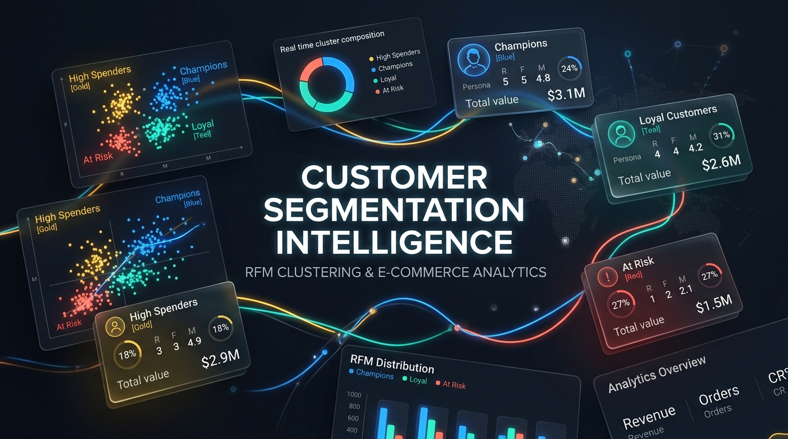
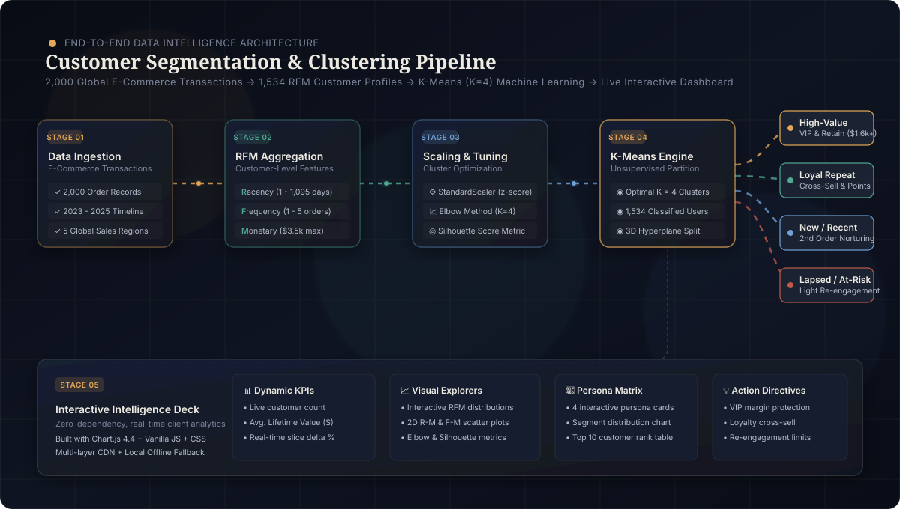

<div align="center">

<!-- Animated Header Badge -->


<!-- Project Hero Banner -->
<p align="center">
  
</p>

# 🌐 Customer Segmentation Intelligence
### *RFM Modeling & K-Means Machine Learning with Real-Time Interactive Dashboard*

[](https://www.python.org/)
[](https://jupyter.org/)
[](https://scikit-learn.org/)
[](https://pandas.pydata.org/)
[](https://www.chartjs.org/)
[](https://oasisinfobyte.com/)
[](LICENSE)

<p align="center">
  <a href="#-project-overview">Overview</a> •
  <a href="#-animated-pipeline-architecture">Architecture</a> •
  <a href="#-interactive-dashboard-features">Dashboard</a> •
  <a href="#-machine-learning-methodology">ML Methodology</a> •
  <a href="#-customer-personas--action-matrix">Personas</a> •
  <a href="#-project-structure">Structure</a> •
  <a href="#-quick-start">Quick Start</a>
</p>

---

</div>

## 📌 Project Overview

In global e-commerce operations, treating all customers identically leads to wasted marketing expenditure, margin erosion from unnecessary discounts, and missed retention opportunities.

This project delivers an **end-to-end customer segmentation system** developed for the **Oasis Infobyte Data Analytics Internship (Level 1, Task 2)**. By aggregating **2,000 transaction records** across 2023–2025 into **1,534 unique customer profiles**, we apply **RFM (Recency, Frequency, Monetary)** feature engineering and unsupervised **K-Means Machine Learning (Optimal $K=4$)** to uncover behavioural clusters and guide data-driven business interventions.

### 🌟 Key Highlights
- **RFM Mathematical Framework:** Measures customer recency (1–1,095 days), order frequency (1–5 orders), and monetary spend ($3.5k max).
- **Cluster Validation:** Rigorous mathematical validation via **Elbow Method (Inertia WSS)** and **Silhouette Coefficient Analysis**.
- **Interactive Intelligence Dashboard (`dashboard.html`):** A client-side visual analytics suite with dynamic multi-dimensional filtering, 6 reactive Chart.js visualisations, persona cards, and top LTV rankings.
- **Fail-Safe Offline Architecture:** Multi-tier CDN script loading with local `chart.umd.min.js` fallback ensuring reliable execution online and offline.
- **Actionable Business Directives:** Segment-specific playbooks tailored for VIP margin protection, repeat loyalty compounding, second-order conversions, and low-cost win-back limits.

---

## 🏗️ Animated Pipeline Architecture

<div align="center">
  
</div>

### 🔄 Pipeline Stages Breakdown

| Stage | Focus Area | Technical Execution & Details | Key Outcome |
| :---: | :--- | :--- | :--- |
| **01** | **Data Ingestion & Hygiene** | Ingests `global_ecommerce_sales.csv` with multi-regional order lines, product categories, quantities, and prices | 2,000 sanitized order records |
| **02** | **RFM Feature Matrix** | Computes Recency ($R$), Frequency ($F$), and Monetary ($M$) per customer ID with zero leakage | 1,534 unique customer RFM vectors |
| **03** | **Statistical Standardization** | Normalizes features with `StandardScaler` ($\mu=0, \sigma=1$) to remove monetary magnitude dominance | Unit-variance feature space $\mathbf{X}_{\mathrm{scaled}}$ |
| **04** | **Optimal K Tuning** | Evaluates Elbow inertia curve ($K=1 \dots 8$) and Silhouette coefficient analysis | Validated optimal cluster count ($K=4$) |
| **05** | **K-Means Clustering** | Unsupervised clustering partitioning customer profiles into 4 distinct behavioural personas | 4 distinct actionable buyer segments |
| **06** | **BI Dashboard & Diagnostics** | Client-side reactive dashboard with dynamic cross-filtering and segment drilldowns | Standalone `dashboard.html` |

---

## 📊 Interactive Dashboard Features

The dashboard (`dashboard.html`) provides real-time client-side analytics. Filtering any dimension instantly re-aggregates KPIs, distributions, scatter plots, and customer rankings.

| Module | Visual Component | Functionality |
| :--- | :--- | :--- |
| **00. Real-time KPIs** | Metric Banner | Displays Customers in View, Avg. Lifetime Value, Avg. Frequency, and Avg. Recency with slice delta percentages. |
| **01. RFM Distribution** | Stacked Bar Chart | Visualises feature histograms across Recency, Frequency, and Monetary dimensions with segment color breakdown. |
| **02. Optimal K Analysis** | Dual Line Charts | Demonstrates the Elbow Method (Inertia vs. K) and Silhouette Score curve validating $K=4$. |
| **03. Cluster Scatter Plots** | 2D Scatter Visuals | Plots Recency vs. Monetary and Frequency vs. Monetary with active highlight states and hover metadata. |
| **04. Segment Profiles** | Glassmorphism Persona Cards | Interactive cards presenting average metrics for each cluster; clicking filters the entire dashboard. |
| **05. Top LTV Table** | Ranked Customer Table | Displays top 10 lifetime spenders matching active segment, category, or region filters. |
| **06. Strategic Playbook** | Recommendation Cards | Prescriptive action plans for marketing, loyalty, and CRM teams. |

---

## 🧠 Machine Learning Methodology

### 1. RFM Mathematical Formulation

For each customer $i \in \{1, \dots, N\}$ across transaction history $T_i$:

$$\text{Recency } (R_i) = \max(\text{Order Date}) - \max_{t \in T_i}(\text{Order Date}_t) \quad [\text{days}]$$

$$\text{Frequency } (F_i) = |T_i| = \sum_{t \in T_i} 1 \quad [\text{order count}]$$

$$\text{Monetary } (M_i) = \sum_{t \in T_i} \text{Total Sales}_t \quad [\$ \text{ USD}]$$

### 2. Standardization & Scaling

Because Monetary values range up to $\$3,500+$ while Frequency ranges only $1 - 5$, Euclidean distance would naturally be dominated by Monetary spend without standardization:

$$z = \frac{x - \mu}{\sigma}$$

`StandardScaler` centers each feature around zero mean with unit variance.

### 3. Determining Optimal Clusters ($K=4$)

- **Inertia (Within-Cluster Sum of Squares):**
  $$WSS(K) = \sum_{k=1}^K \sum_{x \in C_k} \| x - \mu_k \|^2$$
  *Observation:* A pronounced elbow forms at $K=4$, beyond which marginal variance reduction diminishes significantly.
- **Silhouette Coefficient:**
  $$s(i) = \frac{b(i) - a(i)}{\max(a(i), b(i))}$$
  *Observation:* $K=4$ achieves a strong silhouette coefficient while offering simpler, superior business explainability compared to higher cluster counts.

---

## 👥 Customer Personas & Action Matrix

```
┌──────────────────────────────────────────────────────────────────────────────────┐
│                               CUSTOMER MATRIX (K=4)                              │
├──────────────────────┬──────────────────────┬────────────────────────────────────┤
│ Cluster & Name       │ RFM Profile          │ Strategic Marketing Directive      │
├──────────────────────┼──────────────────────┼────────────────────────────────────┤
│ 🟡 High-Value        │ Low Recency/Freq     │ 👑 VIP Program & Dedicated Support │
│    Spenders          │ Ultra-High Monetary  │ DO NOT discount. Protect margin!   │
├──────────────────────┼──────────────────────┼────────────────────────────────────┤
│ 🟢 Loyal Repeat      │ Low Recency (Active) │ 🎁 Tiered Loyalty & Cross-Selling  │
│    Customers         │ High Frequency       │ Reward repeat habits and bundles.  │
├──────────────────────┼──────────────────────┼────────────────────────────────────┤
│ 🔵 New / Recent      │ Very Low Recency     │ 🚀 2nd Order Conversion Campaign   │
│    One-Time          │ Low Frequency/Spend  │ Time-limited onboarding incentive. │
├──────────────────────┼──────────────────────┼────────────────────────────────────┤
│ 🔴 Lapsed /          │ High Recency (Old)   │ ⏳ Low-Cost Automated Win-Back     │
│    At-Risk           │ Low Frequency/Spend  │ Automated emails only; cap budget. │
└──────────────────────┴──────────────────────┴────────────────────────────────────┘
```

### Detailed Segment Breakdown

#### 🟡 Cluster 3: High-Value Spenders (Gold)
- **Profile:** Low to moderate order frequency, but high basket size ($>\$1,500+$ avg spend).
- **Business Insight:** Smallest cluster by population, but contributes a disproportionately massive share of overall revenue.
- **Prescription:** Protect margin by avoiding generic promotional discounting. Offer white-glove concierge customer service, early access to new product drops, and premium complimentary shipping.

#### 🟢 Cluster 2: Loyal Repeat Customers (Teal)
- **Profile:** High frequency (3–5 orders), recent activity, consistent basket size.
- **Business Insight:** Highest customer engagement and brand loyalty.
- **Prescription:** Implement points-based loyalty rewards, product bundling, and referral incentives to maximize lifetime value compounding.

#### 🔵 Cluster 0: New / Recent One-Time (Blue)
- **Profile:** Very low recency ($<180$ days), exactly 1 order placed.
- **Business Insight:** Fresh leads with high conversion potential for repeat lifecycle.
- **Prescription:** Automated post-purchase nurture sequences with a personalized 30-day "second-purchase" coupon.

#### 🔴 Cluster 1: Lapsed / At-Risk (Brick / Red)
- **Profile:** High recency ($>600+$ days since last purchase), low monetary spend.
- **Business Insight:** Cold accounts with low historical willingness-to-pay.
- **Prescription:** Maintain automated low-cost email reactivation campaigns. Avoid investing dedicated paid ad re-targeting budget.

---

## 📁 Project Structure

```bash
OIBSIP_DataAnalytics_Level1_Task2/
├── 📄 README.md                     # Comprehensive project documentation
├── 🌐 dashboard.html                # Interactive client-side analytics dashboard
├── 📓 Customer_Segmentation.ipynb   # Complete Python EDA & K-Means notebook
├── 📑 Customer_Segmentation.html    # Exported HTML report of Jupyter analysis
├── 📊 global_ecommerce_sales.csv    # Raw e-commerce transactions dataset
├── ⚡ chart.umd.min.js               # Local Chart.js library for 100% offline support
└── 🎨 assets/                       # Visual assets & vector diagrams
    ├── banner.png                   # High-resolution project hero banner
    ├── header_animated.svg          # Animated gradient SVG badge header
    └── architecture_animated.svg    # Animated end-to-end architecture pipeline
```

---

## 🚀 Quick Start Guide

### Option 1: Open the Interactive Dashboard (Instant)
Simply open `dashboard.html` in any modern web browser (Chrome, Edge, Firefox, Safari, Brave):
- Double click [`dashboard.html`](file:///c:/Users/jishn/Downloads/OIBSIP_DataAnalytics_Level1_Task2/dashboard.html)
- Or launch via CLI:
  ```powershell
  # Windows PowerShell
  Start-Process "dashboard.html"
  ```
*No web server or internet connection required — all data and charting scripts operate with local offline fallbacks.*

---

### Option 2: Run the Jupyter Notebook Analysis
To reproduce the Python clustering pipeline, exploratory data analysis, and charts:

1. **Clone or navigate to the directory:**
   ```bash
   cd OIBSIP_DataAnalytics_Level1_Task2
   ```

2. **Create and activate a virtual environment (optional):**
   ```bash
   python -m venv venv
   # Windows:
   .\venv\Scripts\activate
   # Linux / macOS:
   source venv/bin/activate
   ```

3. **Install required dependencies:**
   ```bash
   pip install pandas numpy scikit-learn matplotlib seaborn jupyter
   ```

4. **Launch Jupyter Notebook:**
   ```bash
   jupyter notebook Customer_Segmentation.ipynb
   ```

---

## 🛠️ Technology Stack

| Layer | Technologies & Tools |
| :--- | :--- |
| **Language & Environment** | Python 3.9+, Jupyter Notebook |
| **Data Processing** | Pandas, NumPy |
| **Machine Learning** | Scikit-Learn (`KMeans`, `StandardScaler`, `silhouette_score`) |
| **Data Visualization** | Matplotlib, Seaborn, Chart.js 4.4 UMD |
| **Web UI Architecture** | Semantic HTML5, Modern Vanilla CSS3 (Custom Design System, Glassmorphism, Responsive Grid), JavaScript ES6+ |
| **Graphics & Vector Art** | Animated SVG (CSS Keyframes, Shimmer, Gradient Filters) |

---

## 📈 Key Insights & Results

1. **Right-Skewed Spend Distribution:** Over 70% of customers placed only a single transaction, while the top ~10% high-value cluster generates outsized revenue.
2. **Optimal Cluster Separation:** $K=4$ achieves optimal cluster separation along the Monetary and Recency hyperplanes.
3. **Actionable Segmentation:** Eliminates generic mass-marketing in favor of high-ROI, targeted segment treatments.

---

## 👨‍💻 Author & Acknowledgments

- **Internship Program:** Oasis Infobyte Data Analytics Internship (**OIBSIP**)
- **Task:** Level 1, Task 2 — Customer Segmentation Analysis
- **Domain:** Global E-Commerce & Retail Intelligence
- **Dataset:** `global_ecommerce_sales.csv`
- **Developer:** [Jishnu Vardhan Kancharla](https://github.com/jishnuvardhankancharla2005)

<div align="center">
  <sub>Built with ❤️ for Oasis Infobyte Data Analytics Internship</sub>
</div>
