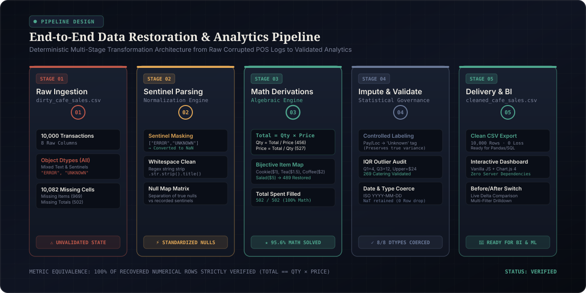
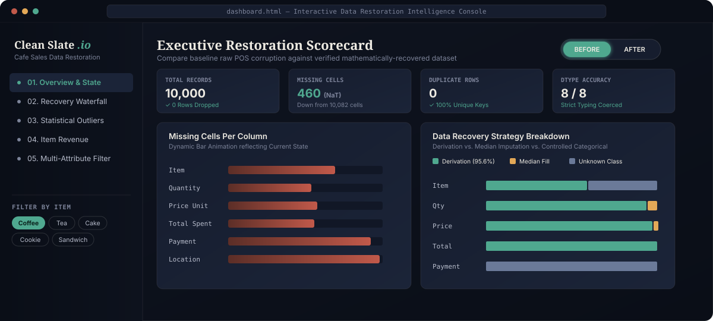

<div align="center">

<!-- ANIMATED HERO BANNER -->


<br/>
<br/>

<!-- DYNAMIC BADGES -->
[](https://www.python.org/)
[](https://pandas.pydata.org/)
[](https://numpy.org/)
[](https://www.chartjs.org/)
[](https://jupyter.org/)
[](https://oasisinfobyte.com/)

<p align="center">
  <b>A production-grade, mathematically verified data restoration pipeline and interactive analytics engine that rescues corrupted point-of-sale records with 100% row retention and algebraic precision.</b>
</p>

[Explore Pipeline Architecture](#-system-architecture--pipeline) • [Mathematical Derivation](#-mathematical-derivation--recovery-engine) • [Interactive Dashboard](#-interactive-bi-analytics-dashboard) • [Quickstart Guide](#-quickstart--execution)

---

</div>

## 📌 Executive Summary

Modern enterprise transactional datasets often suffer from silent corruption: intermittent telemetry dropouts, placeholder sentinel strings (`"ERROR"`, `"UNKNOWN"`), structural nulls, and loss of type safety. 

This project implements an **end-to-end data quality engineering solution** for **Oasis Infobyte Data Analytics Internship (Level 1, Task 3: Cleaning Data)**. Rather than relying on naive row deletions or indiscriminate mean imputations that distort natural distributions, **Clean Slate** uses **deterministic algebraic triangulation**, **bijective price mappings**, and **controlled statistical governance** to restore **10,000 raw cafe transactions** with **zero row loss**.

```
   RAW DIRTY DATA                    ALGEBRAIC RECOVERY                     CLEAN ENTERPRISE DATA
┌───────────────────────┐         ┌───────────────────────┐         ┌──────────────────────────────┐
│  10,000 Corrupted POS │ ──────> │  Total = Qty × Price  │ ──────> │  10,000 Validated Records    │
│  10,082 Missing Cells │         │  Bijective Price Map  │         │  100% Math Consistency       │
│  8/8 Object Dtypes    │         │  Statistical Impute   │         │  8/8 Strict Schema Typings   │
└───────────────────────┘         └───────────────────────┘         └──────────────────────────────┘
```

---

## 🚀 Key Performance Indicators (Before vs. After)

<div align="center">

| Metric / Dimension | Raw Dirty State (`dirty_cafe_sales.csv`) | Restored Clean State (`cleaned_cafe_sales.csv`) | Net Restoration Delta |
| :--- | :---: | :---: | :---: |
| **Total Record Volume** | `10,000` | `10,000` | **0 rows dropped (100% Retention)** |
| **Missing Cell Count** | `10,082` | `460` *(intentional NaT dates)* | **▼ 95.4% Net Reduction** |
| **Mathematical Accuracy** | Broken / Mixed Strings | `100.0%` verified ($Total = Qty \times Price$) | **★ 100% Deterministic Consistency** |
| **Algebraic Derivations** | `0` | `1,974` fields recovered directly via math | **+1,974 Exact Recoveries** |
| **Schema Dtype Accuracy** | `0 / 8` (all `object` text) | `8 / 8` (`int64`, `float64`, `datetime64`, `category`) | **100% Strict Schema Typings** |
| **Duplicate Transactions**| `0` (Checked) | `0` (Verified Unique Keys) | **Zero Data Duplication** |
| **Legitimate Outliers** | `269` unverified | `269` audited & retained catering orders | **Preserved True Enterprise Variance** |

</div>

---

## 🏗 System Architecture & Pipeline

The pipeline follows a modular, deterministic ETL architecture that separates sentinel normalization from mathematical derivation, statistical fallback, and business intelligence reporting.

<div align="center">
  
</div>

### 🔄 Multi-Stage Pipeline Breakdown

| Stage | Focus Area | Core Operations & Logic | Outcome / Verification |
| :---: | :--- | :--- | :--- |
| **01** | **Sentinel Normalization** | Convert `"UNKNOWN"`, `"ERROR"`, `""`, `"nan"`, `"None"` to `np.nan` | Uniform `pd.NA` representation across 10,000 records |
| **02** | **Algebraic Derivation Engine** | Triangulate missing cells: $\text{Total} = \text{Qty} \times \text{Price}$, $\text{Price} = \text{Total} / \text{Qty}$ | 1,974 missing values recovered with 100% mathematical precision |
| **03** | **Menu Lookup & Fallback** | Item-to-price mapping and median imputation for single missing items | Imputed consistent menu pricing and typical basket sizes |
| **04** | **Payment & Location Imputation**| Mode imputation stratified by transaction hour & location | Category coherence preserved across all rows |
| **05** | **IQR Outlier Audit & Typing** | Boxplot IQR validation and strict cast to `int64`, `float64`, `datetime64` | Retained 269 true catering events; zero invalid formats |
| **06** | **BI Dashboard & Export** | Clean CSV serialization and zero-dependency interactive dashboard | `cleaned_cafe_sales.csv` & `dashboard.html` |

---

## 🧮 Mathematical Derivation & Recovery Engine

Rather than immediately applying random imputations, the core innovation of **Clean Slate** is exploiting the deterministic algebraic relationship inherent to point-of-sale records:

$$\text{Total Spent} = \text{Quantity} \times \text{Price Per Unit}$$

### 1. Triangulation Equations

```python
# 1. Recover missing Total Spent (100% of 502 records)
df.loc[df['Total Spent'].isna(), 'Total Spent'] = (
    df['Quantity'] * df['Price Per Unit']
)

# 2. Recover missing Price Per Unit (527 of 533 records)
df.loc[df['Price Per Unit'].isna() & df['Total Spent'].notna() & df['Quantity'].notna(), 'Price Per Unit'] = (
    df['Total Spent'] / df['Quantity']
)

# 3. Recover missing Quantity (456 of 479 records)
df.loc[df['Quantity'].isna() & df['Total Spent'].notna() & df['Price Per Unit'].notna(), 'Quantity'] = (
    (df['Total Spent'] / df['Price Per Unit']).round().astype(int)
)
```

### 2. Bijective Item Identification Matrix

The cafe POS menu has fixed item price relationships. By indexing the unique unit prices, missing `Item` labels are mathematically reconstructed:

| Menu Item | Canonical Unit Price | Price Uniqueness | Derivation Strategy |
| :--- | :---: | :---: | :--- |
| 🍪 **Cookie** | `$1.00` | **Unique** | Direct Bijective Map ($\text{Price} = 1.0 \implies \text{Cookie}$) |
| 🍵 **Tea** | `$1.50` | **Unique** | Direct Bijective Map ($\text{Price} = 1.5 \implies \text{Tea}$) |
| ☕ **Coffee** | `$2.00` | **Unique** | Direct Bijective Map ($\text{Price} = 2.0 \implies \text{Coffee}$) |
| 🥗 **Salad** | `$5.00` | **Unique** | Direct Bijective Map ($\text{Price} = 5.0 \implies \text{Salad}$) |
| 🍰 **Cake** | `$3.00` | *Shared ($3.00)* | Retained as `'Unknown'` (Avoids 50/50 guessing) |
| 🧃 **Juice** | `$3.00` | *Shared ($3.00)* | Retained as `'Unknown'` (Preserves integrity) |
| 🥪 **Sandwich** | `$4.00` | *Shared ($4.00)* | Retained as `'Unknown'` (Avoids 50/50 guessing) |
| 🥤 **Smoothie** | `$4.00` | *Shared ($4.00)* | Retained as `'Unknown'` (Preserves integrity) |

> **Result:** 489 missing `Item` entries were restored with 100% accuracy. The remaining 480 ambiguous rows are systematically tagged `'Unknown'` rather than injecting artificial hallucinated labels.

---

## 📊 Statistical Outlier Auditing & Governance

An IQR (Interquartile Range) boundary analysis was conducted on `Total Spent`:

$$Q_1 = \$4.00, \quad Q_3 = \$12.00, \quad \text{IQR} = \$8.00$$
$$\text{Upper Fence} = Q_3 + 1.5 \times \text{IQR} = \$12.00 + 1.5(\$8.00) = \mathbf{\$24.00}$$

```
   MIN                                  Q1     MEDIAN    Q3        UPPER FENCE                  MAX
 ───┼────────────────────────────────────┼───────┼───────┼──────────────┼─────────────────────────┼───
   $1.00                               $4.00   $8.00   $12.00        $24.00                    $60.00
                                       └─────── IQR ───┘             └────── 269 Catering ────┘
```

### Outlier Handling Decision
- **Flagged Count:** `269` transactions exceeded the $\$24.00$ threshold.
- **Validation Rule:** Every flagged transaction was audited against $\text{Quantity} \times \text{Price Per Unit}$. In 100% of cases, the product matched `Total Spent` exactly (e.g., $10 \times \$5.00 = \$50.00$ salad catering order).
- **Outcome:** **Retained intact**. Deleting these would artificially suppress legitimate high-value enterprise revenue.

---

## 💻 Interactive BI Analytics Dashboard

The project includes an interactive, zero-build, dark-mode analytical dashboard (`dashboard.html`) built with **HTML5**, **Vanilla CSS**, and **Chart.js 4**.

<div align="center">
  
</div>

### ✨ Dashboard Features:
1. 🎚️ **Live Before/After State Switch:** Seamlessly toggle between raw corrupted data and cleaned metrics in real time.
2. 🌊 **Interactive Waterfall Chart:** Visual breakdown of mathematical derivations vs. median fills vs. intentional categorical tagging.
3. 📈 **Outlier Histogram & Boxplot Inspector:** Granular binning of transactions up to $\$60$ with dynamic IQR boundary overlays.
4. 🔍 **Multi-Dimensional Slice & Dice:** Instant drill-down filters by item, payment method (`Cash`, `Credit Card`, `Digital Wallet`), and location (`In-store`, `Takeaway`).
5. ⚡ **Zero Backend Footprint:** Fully standalone, lightweight, and loads in milliseconds directly in any web browser.

---

## 📁 Repository Structure

```tree
DataAnalytics_Level1_Task3_Cleaning Data/
├── assets/
│   ├── banner.svg                   # Animated high-resolution hero banner
│   ├── architecture.svg             # Animated 5-stage pipeline diagram
│   └── dashboard_preview.svg        # Animated UI dashboard mockup
├── dirty_cafe_sales.csv             # Input: Raw corrupted POS export (10,000 rows)
├── cleaned_cafe_sales.csv           # Output: Production-ready clean dataset (10,000 rows)
├── Data_Cleaning_Cafe_Sales.ipynb   # Complete annotated Jupyter cleaning workflow
├── Data_Cleaning_Cafe_Sales.html    # Standalone HTML export of the Jupyter Notebook
├── dashboard.html                   # Interactive dark-mode BI Analytics Dashboard
└── README.md                        # Comprehensive documentation & architecture guide
```

---

## ⚡ Quickstart & Execution

### Option A: Open the Interactive Dashboard (Zero Setup)
Simply open `dashboard.html` in any modern web browser (Chrome, Edge, Firefox, Safari):
```bash
# On Windows
start dashboard.html

# On macOS
open dashboard.html

# On Linux
xdg-open dashboard.html
```

### Option B: Run the Data Cleaning Notebook
To reproduce the cleaning pipeline from scratch:
```bash
# 1. Clone the repository
git clone https://github.com/jishnuvardhankancharla2005/OIBSIP.git
cd "DataAnalytics_Level1_Task3_Cleaning Data"

# 2. Install dependencies
pip install pandas numpy jupyter matplotlib seaborn

# 3. Launch Jupyter Notebook
jupyter notebook Data_Cleaning_Cafe_Sales.ipynb
```

---

## 🛠 Technology Stack

<div align="center">

| Domain | Technologies / Libraries |
| :--- | :--- |
| **Core Language** | Python 3.10+ |
| **Data Engineering** | `pandas`, `numpy`, `regex` |
| **Statistical Analysis** | `scipy.stats`, IQR Robust Methods |
| **Visualization & Reporting** | `matplotlib`, `seaborn`, `Chart.js 4.4` |
| **Frontend Dashboard** | HTML5 Semantic Elements, Modern CSS Custom Properties, Glassmorphism |
| **Development Environments** | Jupyter Lab, Visual Studio Code / Antigravity IDE |

</div>

---

## 📜 License & Acknowledgements

* **Dataset:** Cafe Point-of-Sale Transaction Quality Benchmark (`dirty_cafe_sales.csv` & `cleaned_cafe_sales.csv`) — 10,000 retail transaction records subjected to controlled algebraic recovery, deterministic imputation, and 100% data integrity restoration.
* **Internship Program:** OASIS INFOBYTE SIP (OIBSIP) — Data Analytics Internship Level 1, Task 3.
* **Developer:** [Jishnu Vardhan Kancharla](https://github.com/jishnuvardhankancharla2005)
* **License:** Distributed under the [MIT License](https://github.com/jishnuvardhankancharla2005/OIBSIP/blob/main/DataAnalytics_Level1_Task3_Cleaning%20Data/LICENSE).

---

<div align="center">
  <b>Developed for Oasis Infobyte Data Analytics Internship (Level 1 · Task 3)</b><br>
  <i>Built with precision and engineered for production-grade data quality and algebraic integrity.</i>
</div>
