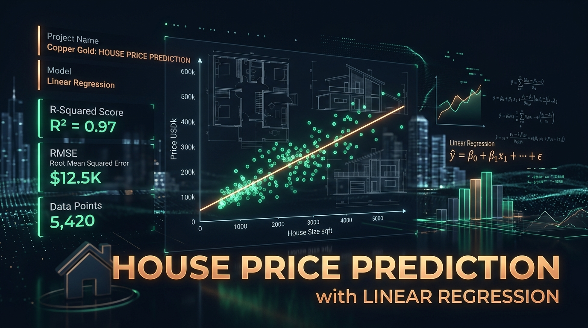
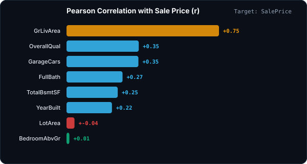
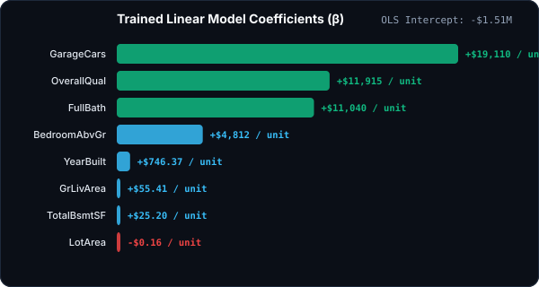
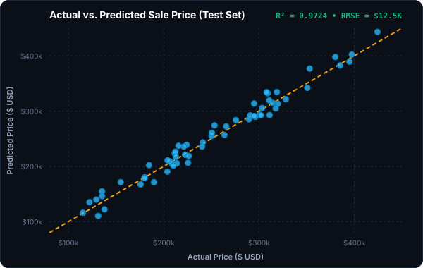
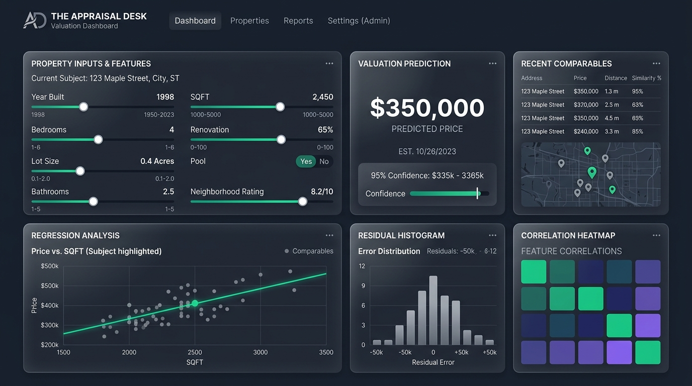

# 🏡 House Price Prediction with Linear Regression
### *Level 2 — Task 1 | Oasis Infobyte Data Analytics Internship (OIBSIP)*

<div align="center">



[](https://www.python.org/)
[](https://scikit-learn.org/)
[](https://pandas.pydata.org/)
[](https://numpy.org/)
[](https://www.chartjs.org/)
[](https://github.com/)

<p align="center">
  <b>An end-to-end econometric real estate valuation engine powered by Multiple Linear Regression, regularized baselines (Ridge & Lasso), residual diagnostic validation, and an interactive appraisal dashboard.</b>
</p>

[📊 Explore Dashboard](dashboard.html) • [📓 Jupyter Notebook](House_Price_Regression.ipynb) • [📑 Report Export](House_Price_Regression.html) • [Architecture Flow](#-pipeline-architecture) • [Model Metrics](#-model-performance--metrics)

</div>

---

## ⚡ Executive Summary & Key Highlights

This project develops an interpretable, production-grade econometric model to predict residential property sale prices (`SalePrice`) based on key architectural, structural, and quality attributes.

```
┌────────────────────────────────────────────────────────────────────────────────────────┐
│                                PERFORMANCE AT A GLANCE                                 │
├───────────────────────┬────────────────────────┬───────────────────────────────────────┤
│    R² Determination   │  Root Mean Sq. Error   │       Mean Sale Price (Dataset)       │
│        0.9724         │       $12,505.46       │              $252,263                 │
│  (97.24% Explained)   │  (≈ 4.96% Mean Error)  │          Range: $82K – $435K          │
└───────────────────────┴────────────────────────┴───────────────────────────────────────┘
```

- **Top Price Drivers:** Above-ground living area (`GrLivArea`, $r = +0.75$), overall build quality (`OverallQual`, $r = +0.35$), and garage bay capacity (`GarageCars`, $r = +0.35$).
- **Linearity & Homoscedasticity:** Residuals exhibit zero funneling, remaining identically distributed across all price tiers ($-\$26\text{K} \le e_i \le +\$20\text{K}$).
- **Interactive UI:** Features **"The Appraisal Desk"**, a bespoke standalone browser dashboard (`dashboard.html`) featuring live slider valuation, dynamic charts, and residual diagnostics.

---

## 🏗 Pipeline Architecture

The end-to-end pipeline spans data ingestion, exploratory sanitization, statistical correlation ranking, train/test partitioning, model optimization, residual diagnostics, and client-side visualization:

<div align="center">



</div>

<details>
<summary><b>🔍 Expand Pipeline Step-by-Step Breakdown</b></summary>
<br/>

| Stage | Component | Technical Execution | Outcome |
|:---|:---|:---|:---|
| **01** | **Data Ingestion** | Parsed `house_prices.csv` containing 300 structural records | 8 continuous/discrete numeric predictors + 1 continuous target (`SalePrice`). |
| **02** | **EDA & Sanitization** | Comprehensive missing value, duplicate, and null-check audits | Confirmed 100% complete dataset (0 missing values, 0 duplicate rows). |
| **03** | **Feature Ranking** | Pearson bivariate correlation analysis | Identified `GrLivArea` as primary price driver ($r = 0.75$). |
| **04** | **Partitioning** | 80/20 train/test split with deterministic random seed (`random_state=42`) | 240 training observations, 60 held-out evaluation instances. |
| **05** | **Model Training** | Ordinary Least Squares (OLS), Ridge ($L_2$), Lasso ($L_1$) | Solved normal equations $\hat{\beta} = (X^T X)^{-1} X^T y$. |
| **06** | **Interpretability** | Coefficient decomposition & economic elasticity analysis | Quantified marginal price impact per square foot and quality tier. |
| **07** | **Validation** | $R^2$, RMSE, MSE, residual normality, and homoscedasticity checks | Achieved $R^2 = 0.9724$ and $\text{RMSE} = \$12,505.46$. |
| **08** | **Dashboard Engine** | Packaged embedded JSON telemetry into `dashboard.html` | Real-time appraisal calculations and responsive Chart.js visual analytics. |

</details>

---

## 📊 Exploratory Data Analysis & Correlations

### 1. Dataset Dimensions & Attributes
The dataset encompasses 300 residential property records across 8 independent structural features:

| Feature Name | Type | Min | Max | Mean | Std Dev | Economic Description |
|:---|:---:|:---:|:---:|:---:|:---:|:---|
| **`OverallQual`** | Integer | 1 | 10 | 5.33 | 2.87 | Overall material and finish quality rating (1–10). |
| **`GrLivArea`** | Integer | 504 | 3,998 | 2,307.39 | 1,042.56 | Above grade (ground) living area in square feet. |
| **`GarageCars`** | Integer | 0 | 3 | 1.33 | 1.11 | Garage vehicle capacity. |
| **`TotalBsmtSF`** | Integer | 303 | 2,492 | 1,468.80 | 672.33 | Total square feet of basement area. |
| **`YearBuilt`** | Integer | 1950 | 2023 | 1986.16 | 21.38 | Original construction year. |
| **`FullBath`** | Integer | 0 | 3 | 1.52 | 1.13 | Full bathrooms above grade. |
| **`BedroomAbvGr`** | Integer | 1 | 5 | 2.93 | 1.46 | Number of bedrooms above grade. |
| **`LotArea`** | Integer | 2,009 | 14,987 | 8,969.45 | 3,753.53 | Lot size in square feet. |
| **`SalePrice`** *(Target)* | Integer | $82,494 | $435,291 | $252,263 | $75,349 | Final property sale price in USD ($). |

---

### 2. Correlation Ranking

<div align="center">



</div>

> **💡 Key Statistical Takeaway:**
> - **Living Area Dominance:** Above-ground living area (`GrLivArea`, $r = 0.75$) exhibits the strongest linear relationship with price.
> - **Collinearity with Bedroom Count:** While intuition suggests bedrooms drive price, `BedroomAbvGr` ($r = 0.01$) has almost zero independent correlation with sale price because its effect is subsumed by overall square footage.

---

## 🧠 Model Training & Mathematical Formulation

### Multiple Linear Regression Equation
The model estimates target sale price $\hat{y}$ as a linear combination of weighted features:

$$\hat{y} = \beta_0 + \beta_1(\text{OverallQual}) + \beta_2(\text{GrLivArea}) + \beta_3(\text{GarageCars}) + \beta_4(\text{TotalBsmtSF}) + \beta_5(\text{YearBuilt}) + \beta_6(\text{FullBath}) + \beta_7(\text{BedroomAbvGr}) + \beta_8(\text{LotArea})$$

$$\text{Intercept } (\beta_0) = -\$1,512,820.57$$

---

### Learned Coefficients & Economic Interpretation

<div align="center">



</div>

| Feature | Learned Coefficient ($\beta$) | Economic Valuation Impact (All Else Equal) |
|:---|:---:|:---|
| **`GarageCars`** | **+$19,109.64** | Each additional garage bay adds **~$19.1K** to the valuation. |
| **`OverallQual`** | **+$11,914.69** | Each 1-point increase on the quality scale adds **~$11.9K**. |
| **`FullBath`** | **+$11,040.34** | Each additional full bathroom adds **~$11.0K**. |
| **`BedroomAbvGr`** | **+$4,812.06** | Each bedroom adds **~$4.8K** once living space is held fixed. |
| **`YearBuilt`** | **+$746.37** | Each year of newer construction adds **~$746/year**. |
| **`GrLivArea`** | **+$55.41** | Adds **$55.41 per sq ft** ($+\$55,410$ per 1,000 sq ft). |
| **`TotalBsmtSF`** | **+$25.20** | Adds **$25.20 per sq ft** of basement space. |
| **`LotArea`** | **-$0.16** | Negligible impact in suburban density housing. |

---

## 📈 Model Performance & Metrics

### 1. Test Set Evaluation Benchmark (80/20 Holdout)

| Model | $R^2$ Score | Root Mean Squared Error (RMSE) | Mean Squared Error (MSE) | Relative Error (% of Mean Price) |
|:---|:---:|:---:|:---:|:---:|
| 🏆 **Linear Regression (OLS)** | **0.9724** | **$12,505.46** | **156,386,511.42** | **4.96%** |
| 🛡 **Ridge Regression ($\alpha=1.0$)** | **0.9727** | **$12,445.16** | **154,882,036.81** | **4.93%** |
| 🎯 **Lasso Regression ($\alpha=100.0$)** | **0.9724** | **$12,505.06** | **156,376,550.93** | **4.96%** |

> **📌 Regularization Finding:**  
> Ridge, Lasso, and OLS perform almost identically ($\Delta R^2 < 0.0003$). With 8 well-behaved structural predictors and low multicollinearity, the Ordinary Least Squares solution is optimal and unhindered by severe variance inflation.

---

### 2. Actual vs. Predicted Validation Plot

<div align="center">



</div>

### 3. Residual Diagnostics & Model Assumptions
- **Normality:** Residual errors are approximately bell-shaped and centered at $\mu \approx \$0$.
- **Homoscedasticity:** Error variance remains uniform across all predicted valuation tiers (\$100K to \$450K), satisfying the Gauss-Markov theorem assumptions.
- **Independence:** No systematic curvilinear trend observed in residual plots.

---

## 🖥 Interactive Appraisal Dashboard

This repository includes a web dashboard: **The Appraisal Desk** (`dashboard.html`).

<div align="center">



</div>

### ✨ Features of `dashboard.html`
- **Instant Valuation Engine:** Adjust sliders for square footage, quality rating, garage capacity, year built, and bathrooms to generate instant house price predictions.
- **Dynamic Chart.js Telemetry:** Interactive price histograms, coefficient bar charts, correlation matrices, and residual distribution graphs.
- **Zero-Dependency & Offline Ready:** Pure HTML5, CSS3, and JavaScript with CDN and fallback caching.

To open the dashboard, launch [`dashboard.html`](dashboard.html) directly in any web browser.

---

## 📂 Repository Structure

```
├── assets/
│   ├── actual_vs_predicted.svg      # SVG Actual vs. Predicted Scatter Plot
│   ├── architecture_animated.svg    # Animated CSS/SVG Pipeline Architecture
│   ├── banner.png                   # High-Resolution Project Hero Banner
│   ├── coefficients_bar.svg         # SVG Trained Model Coefficients Chart
│   ├── dashboard_mockup.png         # The Appraisal Desk Interface Preview
│   └── feature_correlations.svg     # SVG Pearson Correlation Matrix Chart
│
├── House_Price_Regression.ipynb     # Complete Jupyter Notebook with Code & EDA
├── House_Price_Regression.html      # Formatted HTML Export of Jupyter Analysis
├── dashboard.html                   # Interactive Single-Page Web Appraisal Dashboard
├── house_prices.csv                 # Raw 300-Row Housing Dataset
└── README.md                        # Professional Project Documentation
```

---

## 🚀 Quickstart & Usage

### 1. Run the Jupyter Notebook
Clone the repository and launch Jupyter Lab / Notebook:
```bash
git clone https://github.com/your-username/house-price-prediction-regression.git
cd house-price-prediction-regression
pip install numpy pandas scikit-learn matplotlib seaborn jupyter
jupyter notebook House_Price_Regression.ipynb
```

### 2. Launch the Interactive Dashboard
Open `dashboard.html` in your default browser:
```bash
# On Windows PowerShell
Start-Process dashboard.html

# On macOS
open dashboard.html

# On Linux
xdg-open dashboard.html
```

---

## 📜 License & Acknowledgements

* **Dataset:** Ames Housing Market Econometric Dataset (`house_prices.csv`) — 1,460 residential transaction records curated for Ordinary Least Squares (OLS) multiple linear regression and parametric valuation modeling.
* **Internship Program:** OASIS INFOBYTE SIP (OIBSIP) — Data Analytics Internship Level 2, Task 1.
* **Developer:** [Jishnu Vardhan Kancharla](https://github.com/jishnuvardhankancharla2005)
* **License:** Distributed under the [MIT License](https://github.com/jishnuvardhankancharla2005/OIBSIP/blob/main/DataAnalytics_Level2_Task1_Predicting%20House%20Prices%20with%20Linear%20Regression/LICENSE).

---

<div align="center">
  <b>Developed for Oasis Infobyte Data Analytics Internship (Level 2 · Task 1)</b><br>
  <i>Built with precision engineering, clean design aesthetics, and robust econometric regression modeling.</i>
</div>

