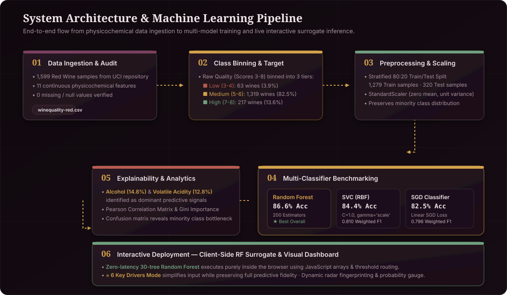
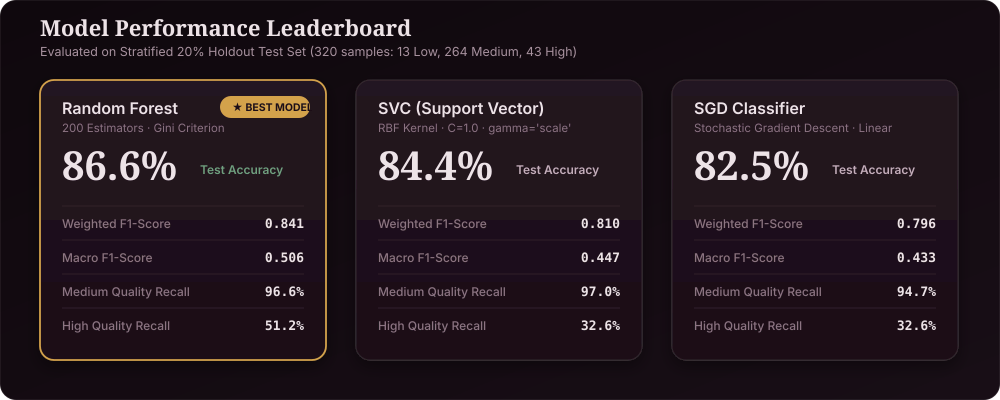
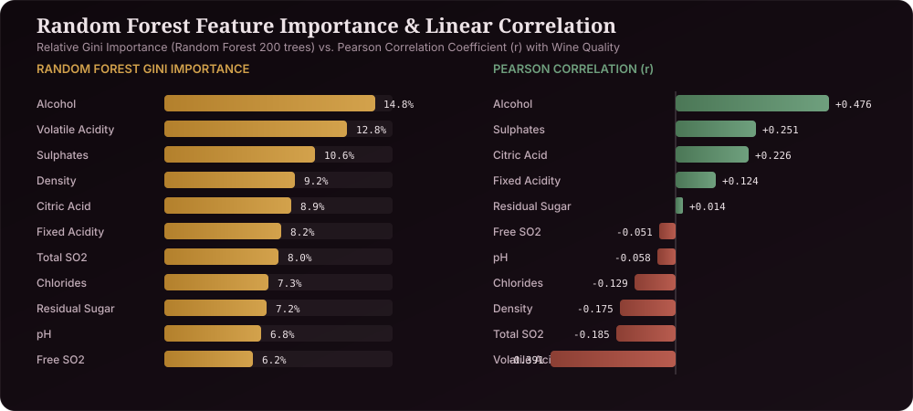

<div align="center">

<!-- Hero Animated Banner -->


<br/>

<!-- Interactive Badges Row -->
[](https://www.python.org/)
[](https://scikit-learn.org/)
[](https://pandas.pydata.org/)
[](https://www.chartjs.org/)
[](https://archive.ics.uci.edu/ml/datasets/wine+quality)
[](LICENSE)

<br/>

<p align="center">
  <b>An end-to-end Machine Learning benchmark, physicochemical feature importance analysis, and zero-latency client-side interactive decision-forest engine for red wine quality classification.</b>
</p>

[✨ Live Interactive Dashboard](Wine_Quality_Dashboard.html) • [📓 Jupyter Notebook Analysis](Wine_Quality_Classification.ipynb) • [📊 Pipeline Architecture](#-system-architecture) • [🏆 Benchmark Leaderboard](#-machine-learning-benchmark--results)

---

</div>

## 📌 Executive Summary

Predicting wine quality purely from chemical properties is a classic real-world classification challenge marked by **severe class imbalance** and **nonlinear interactions**. 

This project explores the canonical **UCI Red Wine Quality Dataset (1,599 samples, 11 physicochemical features)**. We benchmark three distinct classifier families (**Random Forest**, **Support Vector Classifier**, and **Stochastic Gradient Descent Classifier**) and unpack the chemical signatures driving sommelier ratings.

### 🍷 Key Findings at a Glance

* **The Dominant Positive Signal:** **Alcohol content ($r = +0.476$, $14.8\%$ Gini importance)** is the single strongest indicator of higher-tier wines. Higher alcohol levels consistently correlate with optimal fruit ripeness and balanced fermentation.
* **The Dominant Defect Signal:** **Volatile Acidity ($r = -0.391$, $12.8\%$ Gini importance)** is the primary negative driver. High acetic acid imparts a pungent vinegar-like flaw that directly degrades quality scores.
* **The "Headline Accuracy" Trap:** While the Random Forest achieves a strong **$86.6\%$ test accuracy**, the dataset's extreme class imbalance ($82.5\%$ Medium, $13.6\%$ High, only $3.9\%$ Low) means all standard classifiers struggle to detect rare Low-quality wines (predicting them as Medium instead).
* **Zero-Latency Client-Side Inference:** In addition to Python Jupyter analysis, the project includes an interactive web dashboard embedding a compact **30-tree Random Forest surrogate** running purely in vanilla JavaScript without any backend server overhead.

---

## 🏗 System Architecture

<div align="center">
  
</div>

### 🔄 End-to-End Pipeline Workflow

```mermaid
flowchart LR
    A["Raw Dataset\n(1,599 UCI Samples,\n11 Features)"] --> B["Data Auditing & Cleaning\n(Null Checks, Outliers,\nDistributions)"]
    B --> C["Class Binning\n(Scores 3-8 →\nLow / Medium / High)"]
    C --> D["Stratified Split & Scaling\n(80% Train / 20% Test,\nStandardScaler)"]
    D --> E["Model Training & Tuning\n• Random Forest (200 trees)\n• SVC (RBF kernel)\n• SGD Classifier"]
    E --> F["Evaluation & Explainability\n• Confusion Matrix Heatmaps\n• Gini Feature Importance\n• Precision-Recall per Class"]
    F --> G["Deployment\n• Client-Side RF Surrogate\n• Key Drivers Focus Mode\n• Live Dynamic Radar Chart"]

    style A fill:#1E101B,stroke:#7B3F61,stroke-width:2px,color:#EDE3E7
    style C fill:#291A24,stroke:#D3A24C,stroke-width:2px,color:#EDE3E7
    style E fill:#20141C,stroke:#D3A24C,stroke-width:2px,color:#EDE3E7
    style G fill:#1A261D,stroke:#6FA07E,stroke-width:2px,color:#EDE3E7
```



---

## 🏆 Machine Learning Benchmark & Results

All models were evaluated on an identical **Stratified 20% Holdout Test Set (320 samples: 13 Low, 264 Medium, 43 High)** using `StandardScaler` transformations fitted strictly on training splits.

<div align="center">
  
</div>

### 📈 Detailed Benchmark Performance Table

| Model Architecture | Hyperparameters / Setup | Test Accuracy | Macro F1 | Weighted F1 | Low Recall (Minority) | High Recall (Top 13%) | Latency / Complexity |
| :--- | :--- | :---: | :---: | :---: | :---: | :---: | :---: |
| 🌲 **Random Forest** *(Champion)* | `n_estimators=200`, `criterion='gini'` | **86.6%** | **0.506** | **0.841** | 0.0% | **51.2%** | $O(N_{\text{trees}} \times \text{depth})$ |
| ⚡ **Support Vector Machine (SVC)** | `kernel='rbf'`, `C=1.0`, `gamma='scale'` | **84.4%** | 0.447 | 0.810 | 0.0% | 32.6% | $O(N_{\text{sv}} \times d)$ |
| 🎯 **SGD Classifier** | `loss='hinge'`, `max_iter=1000` | **82.5%** | 0.433 | 0.796 | 0.0% | 32.6% | $O(d)$ Linear |

> [!IMPORTANT]
> **Understanding the Macro vs. Weighted F1 Gap:**
> Notice how Weighted F1 scores range from $0.796$ to $0.841$, while Macro F1 scores are lower ($\approx 0.433 - 0.506$). Because **Low-quality wines represent only 3.9% of the dataset**, the models bias toward predicting the majority class (Medium), leading to 0% recall on the rare Low class. This transparently illustrates why monitoring Macro F1 and per-class confusion matrices is essential in imbalanced data analytics.

---

## 📊 Physicochemical Feature Significance & Chemistry Breakdown

<div align="center">
  
</div>

### 🧪 Chemical Attributes Overview

| Feature Name | Mean $\pm$ Std | Min — Max | Pearson $r$ | Gini Imp. | Enological & Chemical Role in Wine Quality |
| :--- | :---: | :---: | :---: | :---: | :--- |
| **Alcohol (% vol)** | $10.42 \pm 1.07$ | $8.4 - 14.9$ | **$+0.476$** | **$14.8\%$** | Primary positive driver. Enhances body, sweetness perception, aromatic volatility, and mouthfeel. |
| **Volatile Acidity** | $0.53 \pm 0.18$ | $0.12 - 1.58$ | **$-0.391$** | **$12.8\%$** | Primary defect signal. Excess acetic acid produces a sour, vinegary off-taste and aroma. |
| **Sulphates** | $0.66 \pm 0.17$ | $0.33 - 2.00$ | **$+0.251$** | **$10.6\%$** | Potassium sulphate additive that acts as an antimicrobial and antioxidant, preserving fresh fruit character. |
| **Density (g/cm³)** | $0.997 \pm 0.002$ | $0.990 - 1.004$ | $-0.175$ | $9.2\%$ | Correlates with residual sugar and alcohol ratio; indicates fermentation completeness and body. |
| **Citric Acid** | $0.27 \pm 0.19$ | $0.00 - 1.00$ | **$+0.226$** | $8.9\%$ | Adds crispness, freshness, and fruit-forward flavor dimension to red wine. |
| **Fixed Acidity** | $8.32 \pm 1.74$ | $4.6 - 15.9$ | $+0.124$ | $8.2\%$ | Non-volatile acids (tartaric/malic) providing baseline tartness and structural pH stability. |
| **Total SO₂** | $46.47 \pm 32.90$ | $6.0 - 289.0$ | $-0.185$ | $8.0\%$ | Total sulfur dioxide. High levels mask delicate fruit notes and cause pungent, unpleasant aromas. |
| **Chlorides** | $0.087 \pm 0.047$ | $0.012 - 0.611$ | $-0.129$ | $7.3\%$ | Salt concentration; excessive salinity creates an undesirable harsh mineral palate. |
| **Residual Sugar** | $2.54 \pm 1.41$ | $0.9 - 15.5$ | $+0.014$ | $7.2\%$ | Unfermented sugar remaining after fermentation; red wines in this dataset are predominantly dry. |
| **pH Level** | $3.31 \pm 0.15$ | $2.74 - 4.01$ | $-0.058$ | $6.8\%$ | Describes the acid-base equilibrium. Typical range is 3.0 to 3.8. |
| **Free SO₂** | $15.87 \pm 10.46$ | $1.0 - 72.0$ | $-0.051$ | $6.2\%$ | Active equilibrium form of $SO_2$ preventing microbial spoilage and oxidation. |

---

## 🖥 Interactive Quality Dashboard Showcase

The repository includes a standalone, production-ready interactive dashboard ([`Wine_Quality_Dashboard.html`](Wine_Quality_Dashboard.html)) designed with modern wine-themed dark aesthetics, smooth micro-interactions, and live client-side inference.

<div align="center">
  <table>
    <tr>
      <td width="50%">
        <b>⭐ Focused 6 Key Drivers Mode</b><br/>
        Sliders for the top 6 chemical features (Alcohol, Volatile Acidity, Sulphates, Citric Acid, Density, Total SO2) with feature impact badges and quick toggles.
      </td>
      <td width="50%">
        <b>📊 Live Decision Forest Inference</b><br/>
        Executes a 30-tree Random Forest surrogate in real-time ($<1\text{ms}$), dynamically calculating class probabilities and verdict cards.
      </td>
    </tr>
    <tr>
      <td width="50%">
        <b>🕸 Dynamic Normalized Radar Fingerprint</b><br/>
        Visualizes the user's custom wine chemistry compared against the baseline dataset average.
      </td>
      <td width="50%">
        <b>🎲 One-Click Real Wine Sample Loader</b><br/>
        Instantly load random actual wine samples from the test set or reset to dataset averages.
      </td>
    </tr>
  </table>
</div>

---

## 📂 Repository Structure

```
DataAnalytics-Level2-Task2-WineQualityPrediction/
│
├── assets/                                 # Visual graphics & SVG diagrams
│   ├── banner.svg                          # Hero animated SVG banner
│   ├── architecture.svg                    # Pipeline & system architecture diagram
│   ├── viz_metrics_comparison.svg          # Model leaderboard & benchmark card
│   └── viz_feature_importance.svg          # Feature importance & correlation chart
│
├── Wine_Quality_Classification.ipynb       # Complete EDA, preprocessing, and model training
├── Wine_Quality_Classification.html        # Exported full execution notebook view
├── Wine_Quality_Dashboard.html             # Standalone interactive dark-mode dashboard
├── winequality-red.csv                     # Original UCI Red Wine physicochemical dataset
└── README.md                               # Comprehensive professional documentation
```

---

## 🚀 Quick Start & Usage

### 1. Clone the Repository
```bash
git clone https://github.com/jishnuvardhankancharla2005/OIBSIP.git
cd "DataAnalytics_Level2_Task2_Wine Quality Prediction/DataAnalytics-Level2-Task2-WineQualityPrediction"
```

### 2. Run the Interactive Dashboard
No server or build process required! Simply double-click or open [`Wine_Quality_Dashboard.html`](Wine_Quality_Dashboard.html) in any modern web browser (Chrome, Edge, Firefox, Safari).

```bash
# Windows PowerShell
Start-Process "Wine_Quality_Dashboard.html"

# macOS
open Wine_Quality_Dashboard.html

# Linux
xdg-open Wine_Quality_Dashboard.html
```

### 3. Run the Jupyter Notebook Analysis
Ensure you have Python 3.9+ installed with the following packages:

```bash
pip install pandas numpy matplotlib seaborn scikit-learn jupyter
jupyter notebook Wine_Quality_Classification.ipynb
```

---

## 🔬 Mathematical & Theoretical Foundations

### 1. Decision Tree Splitting Criterion (Gini Impurity)
At each node $t$ across the 200 trees in the Random Forest, candidate split points $\theta = (j, t_m)$ on feature $j$ and threshold $t_m$ are chosen to maximize the Gini impurity reduction:

$$I_G(t) = 1 - \sum_{k=1}^{K} p(k \mid t)^2$$

$$\Delta I_G = I_G(t) - \frac{N_L}{N} I_G(t_L) - \frac{N_R}{N} I_G(t_R)$$

### 2. Client-Side Surrogate Random Forest Routing
The JavaScript engine stores binary tree arrays `feature[]`, `threshold[]`, `left[]`, `right[]`, and `value[]`. Input vector $\vec{x}$ is routed without recursion:

$$\text{Next Node} = \begin{cases} \text{left}[v], & \text{if } x[\text{feature}[v]] \le \text{threshold}[v] \\ \text{right}[v], & \text{otherwise} \end{cases}$$

Class probabilities are aggregated across all $M = 30$ surrogate trees:

$$P(\text{Class} = c \mid \vec{x}) = \frac{1}{M} \sum_{m=1}^{M} \frac{V_m(c)}{\sum_{k} V_m(k)}$$

---

## 📜 License & Acknowledgements

* **Dataset:** P. Cortez, A. Cerdeira, F. Almeida, T. Matos and J. Reis. *Modeling wine preferences by data mining from physicochemical properties.* Decision Support Systems, Elsevier, 47(4):547-553, 2009. [UCI Machine Learning Repository](https://archive.ics.uci.edu/ml/datasets/wine+quality).
* **Internship Program:** OASIS INFOBYTE SIP (OIBSIP) — Data Analytics Internship Level 2, Task 2.
* **Developer:** [Jishnu Vardhan Kancharla](https://github.com/jishnuvardhankancharla2005)
* **License:** Distributed under the [MIT License](LICENSE).

<div align="center">
  <sub>Crafted with passion for Data Science, Machine Learning, and Enological Analytics.</sub>
</div>
