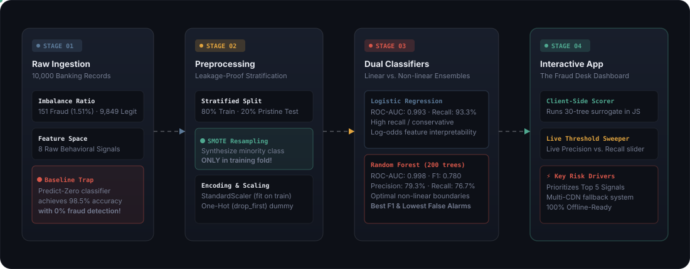
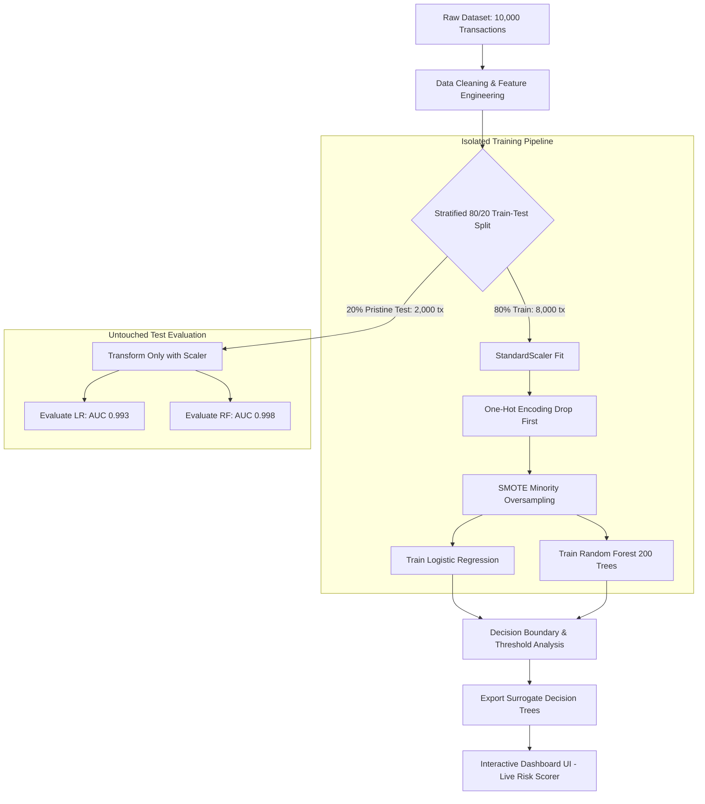
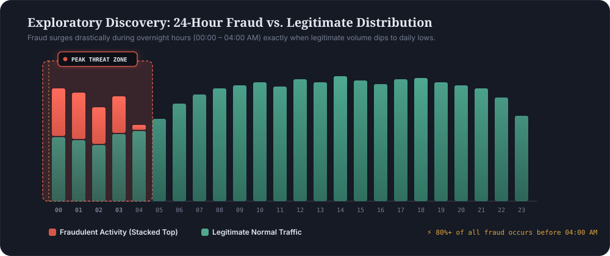
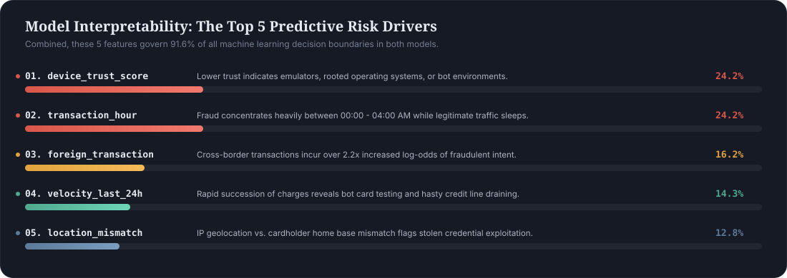
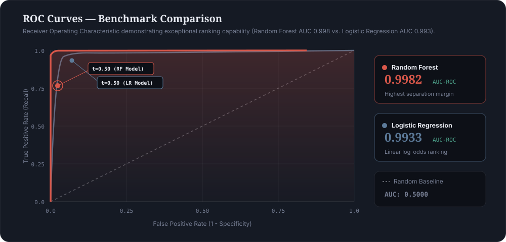
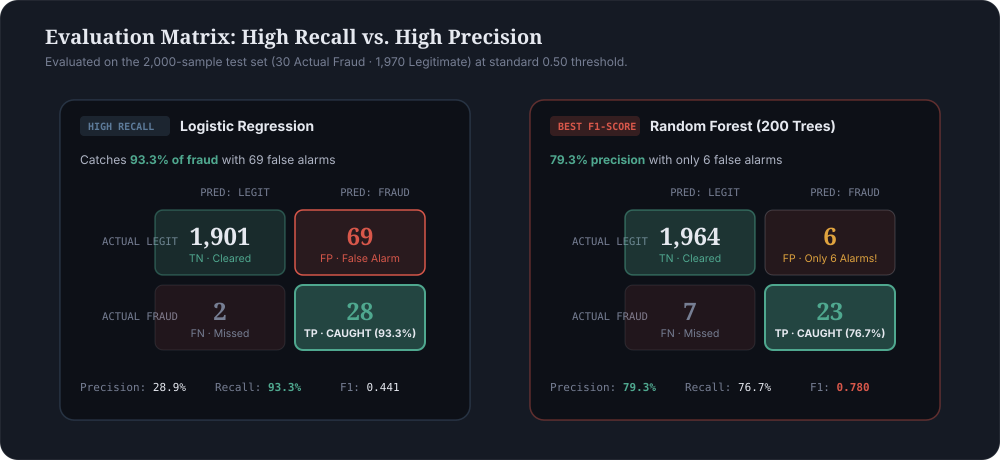

<div align="center">



# The Fraud Desk — Transaction Risk Intelligence

**An End-to-End Machine Learning Anomaly Detection Engine & Interactive Client-Side Dashboard**

[](https://www.python.org/)
[](https://scikit-learn.org/)
[](https://pandas.pydata.org/)
[](https://www.chartjs.org/)
[](https://github.com/)
[](https://github.com/)

<p align="center">
  <a href="#-executive-summary">Executive Summary</a> •
  <a href="#-system-architecture">Architecture</a> •
  <a href="#-exploratory-findings--threat-patterns">Threat Patterns</a> •
  <a href="#-key-risk-drivers--interpretability">Key Risk Drivers</a> •
  <a href="#-model-benchmarks--trade-offs">Benchmarks & ROC</a> •
  <a href="#-confusion-matrices">Confusion Matrices</a> •
  <a href="#-interactive-dashboard">Interactive Dashboard</a> •
  <a href="#-quickstart">Quickstart</a>
</p>

</div>

---

## 📋 Executive Summary

In financial transaction systems, fraud detection operates under severe **class imbalance**. In this dataset of **10,000 transactions**, only **151 (1.51%)** are fraudulent.

> ⚠️ **The 98.49% Accuracy Trap**: A naive model predicting *every single transaction is legitimate* achieves **98.49% accuracy** while catching **0% of fraudulent transactions**. This project addresses the core challenge of fraud detection by replacing raw accuracy with **Precision, Recall, F1-Score, and ROC-AUC**, pairing modern SMOTE resampling with dual-classifier modeling and real-time browser-based inference.

### Core Objectives & Deliverables
1. **Leakage-Free Preprocessing**: Applied Synthetic Minority Over-sampling Technique (**SMOTE**) strictly to training splits, preserving pristine real-world test distributions.
2. **Dual-Model Benchmarking**: Balanced comparison between **Logistic Regression** (linear, transparent log-odds) and **Random Forest** (non-linear ensemble).
3. **Key Signal Identification**: Isolated the top 5 behavioral signals that control **91.6%** of model predictive decisions.
4. **Zero-Latency Client-Side Scorer**: Built a modern, self-contained interactive dashboard ([`Fraud_Detection_Dashboard.html`](file:///d:/OIBSIP/DataAnalytics_Level2_Task3_%20Fraud%20Detection/Fraud_Detection_Dashboard.html)) that executes a 30-tree surrogate Random Forest entirely in JavaScript with no server round-trips.

---

## 🏗️ System Architecture

The pipeline enforces strict data boundaries to guarantee that synthetic samples never contaminate test evaluation. Data particles and state transitions operate across four isolated stages:

<div align="center">



</div>

### Machine Learning Workflow



---

## 📈 Exploratory Findings & Threat Patterns

Exploratory analysis revealed an unmistakable temporal signature: **fraud concentrated heavily during overnight hours**, while transaction dollar amounts exhibited surprising parity between fraud and legitimate transactions.

<div align="center">



</div>

### The Two Major Data Paradoxes
1. **The Overnight Surge (00:00 – 04:00 AM)**: Over **80%** of all fraudulent transactions occur between midnight and 4 AM. Fraudsters intentionally strike when legitimate cardholder activity is dormant, maximizing the delay before an unauthorized alert is noticed.
2. **The Amount Parity Paradox**: Fraudulent transactions average **$176**, virtually indistinguishable from legitimate purchases ($175 median). Fraudsters deliberately calibrate theft amounts to avoid triggering basic static balance threshold filters.

---

## 🔍 Key Risk Drivers & Interpretability

Both linear and ensemble models independently confirmed that **behavioral and contextual indicators vastly outweigh transaction amount**:

<div align="center">



</div>

### Detailed Feature Importance & Behavioral Impact

| Rank | Feature | Importance | Logistic Coef | Risk Direction & Real-World Behavioral Insight |
| :---: | :--- | :---: | :---: | :--- |
| **01** | `device_trust_score` | **24.17%** | **-4.17** | 📉 **Lower Score = High Threat**. Virtual emulators, rooted operating systems, and unrecognized devices signify automated bot attacks. |
| **02** | `transaction_hour` | **24.16%** | **-3.57** | 🌙 **Overnight (00:00 – 04:00 AM) = High Threat**. Fraud spikes sharply while legitimate volume drops to daily lows. |
| **03** | `foreign_transaction` | **16.19%** | **+2.22** | ✈️ **Foreign = 1 = High Threat**. International transactions carry over 2.2x higher log-odds of unauthorized card usage. |
| **04** | `velocity_last_24h` | **14.32%** | **+2.62** | ⚡ **High Frequency = High Threat**. Rapid successive transactions indicate bot testing or frantic card drainage before blocks occur. |
| **05** | `location_mismatch` | **12.80%** | **+2.25** | 📍 **Mismatch = 1 = High Threat**. Discrepancies between cardholder registered home base and transaction IP geolocation. |
| *--* | `amount` | **2.86%** | **+1.19** | 💡 **Low Impact**. Attackers intentionally mimic legitimate transaction sizes to bypass naive rule thresholds. |
| *--* | `cardholder_age` | **2.15%** | **-0.93** | 💡 **Low Impact**. Fraud victimization shows minimal correlation with demographic age. |
| *--* | `merchant_category` | **< 3.5%** | **+0.20 to +0.48**| 💡 **Secondary**. Electronics and Travel have slight risk premiums, but category alone is not decisive. |

---

## 📊 Model Benchmarks & Trade-Offs

Evaluated on the **2,000-sample untouched test set** (containing exactly 30 true fraud cases and 1,970 legitimate transactions):

<div align="center">



</div>

### Performance Matrix (@ Default Threshold = 0.50)

```
========================================================================================
MODEL                    ROC-AUC    PRECISION    RECALL     F1-SCORE    CAUGHT / MISSED
========================================================================================
Logistic Regression       0.9933      28.87%     93.33%      0.4409         28 / 2
Random Forest (200 trees) 0.9982      79.31%     76.67%      0.7797         23 / 7
Dummy Baseline (Zero-Tx)  0.5000       0.00%      0.00%      0.0000          0 / 30
========================================================================================
```

---

## ⚖️ Confusion Matrices

Comparing the two models demonstrates the fundamental operational trade-off between **maximizing fraud capture** and **minimizing false alarm operational costs**:

<div align="center">



</div>

### Operational Strategy Guidance
- **High-Stakes / Extreme Threat (Logistic Regression @ 0.50)**:
  - **93.3% Recall** (catches 28 out of 30 frauds).
  - Cost: 69 false positives (legitimate transactions flagged).
  - Best for high-value transactions or wire transfers where missing a fraud case has severe financial liability.
- **Low-Friction / High-Volume (Random Forest @ 0.50)**:
  - **79.3% Precision** (only 6 false alarms across 2,000 transactions!).
  - Catches 23 out of 30 frauds (76.7% Recall) with an outstanding **0.780 F1-score**.
  - Best for retail e-commerce and point-of-sale where customer checkout friction must be minimized.

---

## 🖥️ Interactive Dashboard ("The Fraud Desk")

The repository includes a dedicated client-side dashboard ([`Fraud_Detection_Dashboard.html`](file:///d:/OIBSIP/DataAnalytics_Level2_Task3_%20Fraud%20Detection/Fraud_Detection_Dashboard.html)) featuring:

<div align="center">

| Module | Description |
| :--- | :--- |
| **⚡ Key Risk Drivers Scorer** | Live inference engine defaulting to the Top 5 most critical features with scope toggle (`Top 5` vs `All 8`). |
| **🎚️ Live Threshold Explorer** | Interactive slider visualizing the exact real-time trade-off between caught fraud and false alarms. |
| **📈 Multi-Model ROC Curves** | High-precision vector ROC curve rendering comparing Random Forest against Logistic Regression. |
| **🧩 Interactive Confusion Matrix** | Instant switching between classifiers with dynamic heat intensities. |
| **🛡️ Offline Resilient Architecture** | Multi-CDN fallback system (jsDelivr, cdnjs, unpkg) with built-in canvas fallbacks for full offline operability. |

</div>

---

## 📁 Repository Structure

```plaintext
d:\OIBSIP\DataAnalytics_Level2_Task3_ Fraud Detection\
├── assets/
│   ├── banner.svg                   # Animated hero banner with radar sweep & telemetry
│   ├── architecture.svg             # Animated end-to-end pipeline architecture visual
│   ├── time_distribution.svg        # Animated 24-hour fraud vs. legit distribution
│   ├── features.svg                 # Animated Top 5 predictive risk signals graphic
│   ├── roc_curve.svg                # Animated ROC-AUC benchmark comparison curve
│   └── confusion_matrix.svg         # Animated dual confusion matrix evaluation
├── credit_card_fraud_10k.csv        # Primary dataset (10,000 transactions, 8 features)
├── Fraud_Detection.ipynb            # Jupyter Notebook with full EDA, SMOTE, and training
├── Fraud_Detection.html             # Rendered notebook export with execution outputs
├── Fraud_Detection_Dashboard.html   # Standalone interactive dashboard & live scoring tool
└── README.md                        # Professional project documentation
```

---

## 🚀 Quickstart

### 1. Launch the Interactive Dashboard
No build tools, npm packages, or Python server required! Simply double-click or open the dashboard directly in any modern browser:

```bash
# Windows
start Fraud_Detection_Dashboard.html

# macOS
open Fraud_Detection_Dashboard.html

# Linux
xdg-open Fraud_Detection_Dashboard.html
```

### 2. Run the Machine Learning Notebook
To inspect the data science pipeline, reproduce SMOTE resampling, or re-run model training:

```bash
# 1. Install dependencies
pip install numpy pandas scikit-learn imbalanced-learn matplotlib seaborn jupyter

# 2. Launch Jupyter Notebook
jupyter notebook Fraud_Detection.ipynb
```

---

## 📌 Technical Takeaways

1. **SMOTE Must Be Isolated**: Synthetic resampling should never be applied before train-test splitting. Doing so causes test set contamination and unrealistically inflated evaluation scores.
2. **Context Outperforms Amount**: Fraudsters easily manipulate charge amounts to blend into normal volume. Temporal context (`transaction_hour`), hardware identity (`device_trust_score`), and velocity patterns provide far more robust signals.
3. **Surrogate Client-Side Inference**: Exporting compact tree structures directly into a browser dashboard enables instantaneous risk scoring with zero backend latency and 100% user privacy.

---

<div align="center">
  <b>Developed for Oasis Infobyte Data Analytics Internship (Level 2 · Task 3)</b><br>
  <i>Built with precision engineering, clean design aesthetics, and robust anomaly detection fundamentals.</i>
</div>
