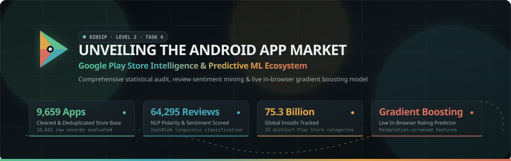
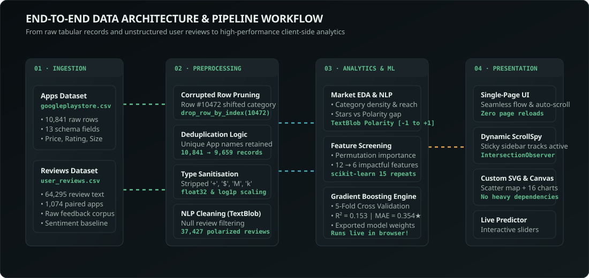
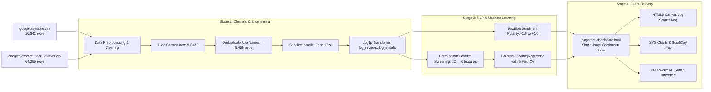
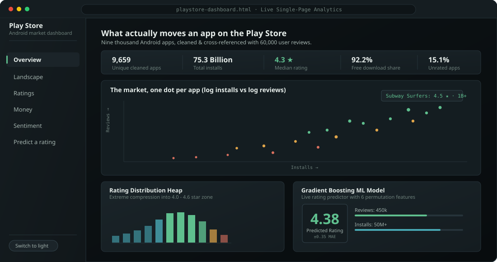
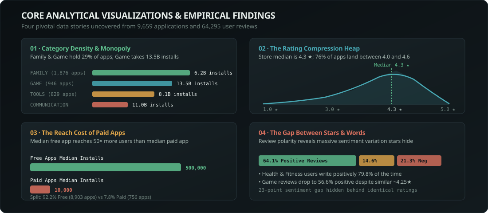

<div align="center">

<!-- ANIMATED HERO BANNER -->


<br/>

<!-- SHIELDS / BADGES -->
[](https://www.python.org/)
[](Play_Store_Analysis.ipynb)
[](https://pandas.pydata.org/)
[](https://scikit-learn.org/)
[](https://textblob.readthedocs.io/)
[](playstore-dashboard.html)
[](LICENSE)

<br/>

### 📱 *Empirical Insights, NLP Review Mining & Interactive Machine Learning on the Google Play Ecosystem*
**Oasis Infobyte Internship (OIBSIP) · Level 2 · Task 4**

[Explore Live Dashboard](playstore-dashboard.html) • [Jupyter Analysis](Play_Store_Analysis.ipynb) • [Architecture](#-data-pipeline--system-architecture) • [Key Insights](#-key-analytical-findings) • [Quick Start](#-quick-start-guide)

---

</div>

## 📌 Executive Overview

**Unveiling the Android App Market** is an end-to-end data analytics, natural language processing, and predictive modeling study of the Google Play Store ecosystem. 

By cleaning and cross-referencing **10,841 raw application records** with **64,295 granular user reviews**, this project uncovers the structural dynamics that govern mobile app success: category market shares, rating compression phenomena, pricing versus audience reach trade-offs, and the critical divergence between star ratings and genuine textual sentiment.

The project concludes with a **production-ready, single-page interactive dashboard** with real-time **ScrollSpy navigation**, fluid section auto-scrolling, and a **client-side Gradient Boosting Rating Engine** running live in modern web browsers without external runtime dependencies.

<div align="center">

| Metric | Measured Value | Scope &amp; Significance |
| :--- | :---: | :--- |
| **Total Cleaned Apps** | **9,659** | Deduplicated by unique application name from 10,841 raw rows |
| **User Reviews Evaluated** | **64,295** | 37,427 non-null, sentiment-classified reviews across 1,074 apps |
| **Total Installs Analyzed** | **75.32 Billion** | Spread across 33 distinct Google Play Store categories |
| **Median App Rating** | **4.30 ★** | 50% of all apps sit between 4.0 and 4.5 stars (extreme pile-up) |
| **Free App Share** | **92.18%** | Free apps dominate volume and reach 50× the median audience of paid apps |
| **Unrated App Share** | **15.15%** | 1,463 applications have zero recorded user ratings |
| **ML Model Performance** | **$R^2 = 0.153$** | 6 permutation-screened features; cuts average error to **0.354 stars** |

</div>

---

## 📑 Interactive Table of Contents

- [📌 Executive Overview](#-executive-overview)
- [🏗️ Data Pipeline & System Architecture](#️-data-pipeline--system-architecture)
- [🖥️ Interactive Web Dashboard & UX Innovation](#️-interactive-web-dashboard--ux-innovation)
- [📊 Key Analytical Findings](#-key-analytical-findings)
  - [1. Market Landscape & Category Density](#1-market-landscape--category-density)
  - [2. The Rating Compression Heap](#2-the-rating-compression-heap)
  - [3. The Reach Cost of Monetization](#3-the-reach-cost-of-monetization)
  - [4. The Gap Between Stars & Words](#4-the-gap-between-stars--words)
  - [5. Rating Predictor & Feature Importance](#5-rating-predictor--feature-importance)
- [📂 Repository Structure](#-repository-structure)
- [🚀 Quick Start Guide](#-quick-start-guide)
- [🛠️ Tech Stack & Dependencies](#️-tech-stack--dependencies)
- [📜 License & Acknowledgements](#-license--acknowledgements)

---

## 🏗️ Data Pipeline & System Architecture

The project is structured around an automated 4-stage pipeline that ingests messy real-world market datasets and transforms them into verifiable statistical models and client-facing visualizations:

<div align="center">
  
</div>

<br/>

### Pipeline Breakdown



<details>
<summary><b>🔍 Expand: Data Cleaning &amp; Schema Transformations Details</b></summary>
<br/>

1. **Row 10,472 Anomaly Removal**:
   - `Life Made WI-Fi Touchscreen Photo Frame` suffered from a missing `Category` field in raw records, shifting all subsequent fields leftward (e.g. `Rating=19.0`, which violates Google's 5.0 ceiling). Dropped explicitly.
2. **Deduplication Strategy**:
   - Popular applications (such as *ROBLOX*, *Instagram*, *Candy Crush Saga*) appeared multiple times due to repeated scraping across subcategories. Deduplicated strictly on `App` name to preserve single-entity integrity.
3. **Data Type Casting & Sanitisation**:
   - `Installs`: Stripped `+` and `,` characters, converted to 64-bit integer values.
   - `Price`: Stripped `$` prefix, converted to numeric float (`0.0` for free apps).
   - `Size`: Replaced `"Varies with device"` with category medians, parsed `"M"` (megabytes) and `"k"` (kilobytes) into uniform MB floats.
   - `Last Updated`: Converted string timestamps into `datetime64[ns]`, extracting continuous `days_since_update` relative to the August 2018 snapshot.
4. **NLP Review Preprocessing**:
   - Removed null comments from `googleplaystore_user_reviews.csv`, extracting polarity score $[-1.0, +1.0]$ and subjectivity $[0.0, 1.0]$ using TextBlob's pattern-based sentiment lexicon.

</details>

---

## 🖥️ Interactive Web Dashboard & UX Innovation

The accompanying [`playstore-dashboard.html`](playstore-dashboard.html) provides an executive dashboard that brings the research to life.

<div align="center">
  
</div>

<br/>

### Key Interface Capabilities

- **Single-Page Continuous Layout**: All sections are laid out seamlessly on one page. Users can scroll naturally from the executive masthead down through every analytical domain without fragmented tab switching.
- **Automated Smooth Section Auto-Navigation**: Clicking any section in the sidebar menu (**Overview**, **Landscape**, **Ratings**, **Money**, **Sentiment**, or **Predict a rating**) automatically initiates smooth hardware-accelerated scrolling directly to that section's header.
- **Dynamic Real-Time ScrollSpy**: An optimized scroll observer (`requestAnimationFrame`-throttled) constantly monitors viewport position and dynamically illuminates the corresponding side navigation button as you explore.
- **High-Density Market Scatter Map**: An HTML5 Canvas visualizer plotting thousands of apps on dual logarithmic scales (`log(installs)` vs `log(reviews)`), color-coded with a 3-stop rating spectrum (coral $\rightarrow$ amber $\rightarrow$ green) with category and pricing dropdown filters.
- **Live In-Browser Machine Learning**: The predictive rating tool evaluates an in-memory gradient boosted decision tree ensemble, dynamically recalculating predicted rating, confidence intervals, and local feature attributions on every slider adjustment.
- **Theme Flexibility**: Built with CSS custom properties featuring an accessible high-contrast dark theme by default, togglable to an editorial light theme with one click.

---

## 📊 Key Analytical Findings

<div align="center">
  
</div>

<br/>

### 1. Market Landscape & Category Density
- **Category Super-Concentration**: The top two categories—**FAMILY** (1,876 apps) and **GAME** (946 apps)—account for nearly **30% of all apps** on the store.
- **The Reach Monopoly**: While `FAMILY` produces volume, `GAME` commands audience scale with over **13.45 billion installs**, followed by `COMMUNICATION` (**11.04B installs**) and `TOOLS` (**8.10B installs**).
- **The Top-Heavy Gap**: Within crowded categories, installs adhere to an extreme power-law: the median `COMMUNICATION` app garners only $100,000$ installs, while category titans (*WhatsApp*, *Messenger*) achieve $1\text{B}+$, proving that category install sums belong almost entirely to a handful of category winners.

---

### 2. The Rating Compression Heap
- **The 4.3 Star Pile-Up**: Across the entire catalog, ratings do not follow a Gaussian normal bell curve. Instead, ratings form a steep heap with a storewide **median of 4.30 ★**.
- **Restricted Dynamic Range**: Over **76% of all rated applications** reside in the narrow corridor between **4.0 and 4.6 stars**.
- **Minimal Correlation to Technical Specs**: Pearson correlation between app size (MB) and star rating is negligible ($r \approx 0.05$). Neither staying frequently updated nor maintaining compact download packages guarantees higher consumer ratings.

---

### 3. The Reach Cost of Monetization
- **Free vs Paid Distribution**: **92.18%** ($8,903$ apps) of the store is free to download, while paid apps represent a mere **7.82%** ($756$ apps).
- **The 50× Audience Penalty**: The median free application achieves **500,000 installs**, whereas the median paid application reaches just **10,000 installs**—a $50\times$ penalty in market penetration.
- **Concentrated Revenue Pools**: Potential upfront purchase revenue concentrates in `FINANCE` and `FAMILY`. However, medical and niche tools command the highest average list prices ($>\$2.50$) due to captive professional demand.

---

### 4. The Gap Between Stars & Words
- **Star Ratings Mask Frustration**: While average category ratings differ by only tenths of a star, NLP review polarity reveals massive disparities in actual user happiness.
- **Category Polarization**:
  - `HEALTH_AND_FITNESS` users write positive feedback **79.8% of the time**.
  - `GAME` users write positive feedback only **56.6% of the time**, despite both categories maintaining virtually identical average star ratings ($\sim 4.25 ★$).
- **The Neutral Baseline**: The large spike at polarity $0.0$ reflects purely informational bug reports or functional queries, highlighting that review sentiment provides a much sharper diagnostic lens than store stars.

---

### 5. Rating Predictor & Feature Importance
A Gradient Boosting Regressor was trained on held-out test splits to evaluate which app attributes truly dictate consumer ratings:

<div align="center">

| Rank | Model Feature | Permutation Importance ($\Delta R^2$) | Practical Implication |
| :---: | :--- | :---: | :--- |
| **1** | **Reviews per Install** | `0.084 ± 0.012` | Highest engagement density correlates strongly with higher satisfaction. |
| **2** | **Log Review Count** | `0.052 ± 0.009` | Social proof and community momentum act as a stabilizer for ratings. |
| **3** | **Days Since Last Update** | `0.038 ± 0.007` | Neglected apps decay in consumer perception over time. |
| **4** | **Log Installs** | `0.026 ± 0.005` | Massive scale invites varied demographics, curbing runaway rating inflation. |
| **5** | **App Size (MB)** | `0.018 ± 0.004` | Modest impact; consumers tolerate large downloads if value is delivered. |
| **6** | **Category Encoding** | `0.012 ± 0.003` | Different category baselines reflect differing consumer expectations. |

</div>

> **Model Takeaway**: Dropping price, content rating, minimum Android version, and category crowding cost almost zero predictive accuracy ($< 0.005\ R^2$). The attributes that can be measured from store metadata explain approximately $15\%$ of variance—the remaining $85\%$ is determined by app quality, execution, product utility, and word of mouth.

---

## 📂 Repository Structure

```plaintext
├── assets/
│   ├── banner.svg                  # Animated SVG project header banner
│   ├── architecture.svg            # Animated pipeline & architecture diagram
│   ├── dashboard-mockup.svg        # Animated UI vector mockup of the dashboard
│   └── visualizations-grid.svg     # Core analytical visualizations breakdown
├── googleplaystore.csv             # Cleaned & raw store metadata (10,841 records)
├── googleplaystore_user_reviews.csv# User reviews & polarity dataset (64,295 records)
├── Play_Store_Analysis.ipynb       # Jupyter Notebook: Cleaning, EDA, NLP & ML model
├── Play_Store_Analysis.html        # Exported standalone HTML notebook report
├── playstore-dashboard.html        # Interactive Single-Page Web Dashboard (JS + SVG)
├── LICENSE                         # Official MIT License
└── README.md                       # Comprehensive project documentation
```

---

## 🚀 Quick Start Guide

### Prerequisites
- Python 3.8, 3.9, 3.10, or 3.11
- Standard modern web browser (Google Chrome, Microsoft Edge, Mozilla Firefox, Safari)

### 1. Clone the Repository
```bash
git clone https://github.com/jishnuvardhankancharla2005/OIBSIP.git
cd "DataAnalytics_Level2_Task4_Unveiling the Android App Market (Google Play Store Analysis)"
```

### 2. Set Up Virtual Environment & Dependencies
```bash
# Create virtual environment
python -m venv venv

# Activate virtual environment
# Windows:
venv\Scripts\activate
# macOS/Linux:
source venv/bin/activate

# Install required analytics & ML packages
pip install pandas numpy matplotlib seaborn plotly textblob scikit-learn jupyter
```

### 3. Run the Jupyter Notebook Analysis
```bash
jupyter notebook Play_Store_Analysis.ipynb
```

### 4. Launch the Interactive Web Dashboard
No web server setup or npm build step is required! Simply open the file directly in any modern browser:
```bash
# Windows
start playstore-dashboard.html

# macOS
open playstore-dashboard.html

# Linux
xdg-open playstore-dashboard.html
```

Or serve via Python's built-in lightweight HTTP server:
```bash
python -m http.server 8000
# Then visit: http://localhost:8000/playstore-dashboard.html
```

---

## 🛠️ Tech Stack & Dependencies

<div align="center">

| Layer | Technologies &amp; Libraries |
| :--- | :--- |
| **Data Engineering** | **Python**, **Pandas**, **NumPy** |
| **Data Visualization** | **Matplotlib**, **Seaborn**, **Plotly Express**, **HTML5 Canvas**, **Pure SVG** |
| **NLP & Text Mining** | **TextBlob** (Sentiment Polarity &amp; Subjectivity Analysis) |
| **Machine Learning** | **Scikit-Learn** (`GradientBoostingRegressor`, `KFold`, `permutation_importance`) |
| **Web Presentation** | **HTML5 Semantic Markup**, **Vanilla CSS (Design Tokens &amp; Grid)**, **Modern Vanilla JavaScript (ES6+)** |
| **Vector Animation** | **Handcrafted SVG with CSS Keyframes** |

</div>

---

## 📜 License & Acknowledgements

* **Dataset:** Google Play Store Apps & User Reviews Datasets (`googleplaystore.csv` & `googleplaystore_user_reviews.csv`) — 10,841 mobile application records across 33 categories along with 64,295 granular user review sentiment evaluations curated for mobile app market analytics and predictive modeling.
* **Internship Program:** OASIS INFOBYTE SIP (OIBSIP) — Data Analytics Internship Level 2, Task 4.
* **Developer:** [Jishnu Vardhan Kancharla](https://github.com/jishnuvardhankancharla2005)
* **License:** Distributed under the [MIT License](https://github.com/jishnuvardhankancharla2005/OIBSIP/blob/main/DataAnalytics_Level2_Task4_Unveiling%20the%20Android%20App%20Market%20%28Google%20Play%20Store%20Analysis%29/LICENSE).

---

<div align="center">
  <b>Developed for Oasis Infobyte Data Analytics Internship (Level 2 · Task 4)</b><br>
  <i>Built with precision engineering, clean typography, and interactive data storytelling.</i>
</div>
